# Fire-Adapted Forest Carbon: An Observed-Counterfactual Quantification Approach

*Katharyn Duffy¹,² ([ORCID 0000-0001-6108-7718](https://orcid.org/0000-0001-6108-7718)) · Ethan Yackulic³ ([ORCID 0000-0001-5500-0401](https://orcid.org/0000-0001-5500-0401)) · Spencer Plumb⁴ ([ORCID 0000-0002-0821-8755](https://orcid.org/0000-0002-0821-8755))*

*¹ Vibrant Planet · ² Northern Arizona University · ³ American Forest Foundation · ⁴ Verra*

**v1.0 — from M0159 canon v3.1, August 2026**

***

**Dedicated to the keepers of the fire:**

We honor the Indigenous fire practitioners and knowledge holders whose stewardship shaped and sustains the fire-adapted landscapes this methodology addresses. Their practices — cultural, spiritual, and ecological — remain essential to restoring balance to these ecosystems worldwide. We are grateful to the nations, communities, and practitioners who have carried this work through generations. This methodology rests on their knowledge, and we commit to learning from and supporting Indigenous-led fire governance and sovereignty.

***

**Contributions & Acknowledgements:**

This methodology was developed by Dr. Katharyn Duffy, Dr. Ethan Yackulic, and Dr. Spencer Plumb.

This work has been supported by many organizations and individuals over the years to bring it to fruition including but not limited to: Ashley Conrad-Saydah, Dr. David Diaz, Dr. Joe Shannon, Dr. Micah Elias, Dr. Phil Saska, Dr. Chris Woodall, Dr. Lara Murray, Marcus Selig, Dr. Erik Neilsen, Dr. Pete Fulé, and Dr. Matt Hurteau.

**Funding Acquisition:**

Ashley Conrad-Saydah, Jillian Dyszynski, and Dr. Katharyn Duffy secured funding to support the methodology. This work was partially funded by the American Forest Foundation, as a recipient of an award from the USDA Forest Service #24-CA-11132544-064 Removing Barriers to Scaling the Family Forest Carbon Program and Market Opportunities for Family Forest Landowners.

***

## About This Approach

We have known how to temper high-severity fire for decades: thinning, prescribed or cultural fire, and restoration of the open stand structures that frequent fire once maintained. In fire-adapted forests these treatments stabilize forest carbon storage, improve forest health, and reduce the likelihood of stand-replacing fire when it does occur (Yackulic et al. 2025; Truettner et al. 2026). What has lagged is the accounting: quantification rigorous enough to meet voluntary and regulatory demand.

The obstacle lies in generating a counterfactual. A treatment's carbon benefit is largely carbon kept in the forest — stores that survive fire because fuels were reduced — and what is kept can only be measured against the untreated fate of the same forest. Wildfire is stochastic and heterogeneous: where it burns, and how severely, varies pixel to pixel and year to year. Plots cannot sample that variance, and growth-and-yield models cannot predict it. The only credible counterfactual is an observed one.

This approach lays out a natural experimental design to quantitatively observe the impacts of proactive fire fuel reduction treatments. Each project is paired at the outset with a fixed control area matched on pretreatment conditions, and both are observed — every pixel, every year, by the same remote-sensing product — for the life of the project. Field inventories test the remotely sensed record at each verification, and every correction runs one direction: it can only reduce credited benefit. Residual uncertainty is charged once, as a single conservative deduction, before any credit is calculated.

Accounting for two scenarios at annual, pixel-level resolution is beyond manual execution; only remote sensing can supply the data, and only code can carry the pixel-by-pixel complexity of calculations. This approach is therefore digitally native. The implementation in this repository is the operative form of the methodology, and this document lays the same logic out in full — observation to issued credit, all 87 equations in execution order — so that every reported number traces back to the data that produced it.

We drafted this approach for the Verra VCS Program as **M0159, Improved Forest Management for Fire-Adapted Forests**, where it is under review. This document is M0159's technical complement: the same science, equations, and accounting, stripped of program-specific requirements so that it stands alone — a specification for the code, a reference for peer review, and a quantification approach any crediting program or research application can adopt.

**How to read it.** The document is descriptive. It states what the calculations do and why each design choice is conservative, and it distinguishes the inputs a project supplies — treatment records, fire perimeters, field inventories, the approved remote-sensing product — from what the code computes from them. Sections run in execution order: the science case (§1–2), where the approach applies (§3–4), the observation system (§5), the matched counterfactual (§6–7), the accounting pipeline (§8–11), spillovers (§12), the credit ledger (§13), the data record (§14), and definitions and sources (§15–17).

***

# 1 Background: Fire-Adapted Forests

Fire is a fundamental ecological process in frequent-fire forests. More than a century of fire suppression, timber harvest, and grazing has disrupted these fire regimes, leaving such forests overstocked and prone to high-severity, stand-replacing wildfire that threatens ecosystem resilience and the stability of stored carbon (Abatzoglou & Williams 2016; Westerling 2016).

## 1.1 Definition

Fire-adapted forests are ecosystems in which fire is a recurring ecological process that has historically shaped forest structure, composition, regeneration, nutrient cycling, fuel dynamics, and landscape pattern. Fire adaptation is expressed through species traits, stand structures, fuel arrangements, patch mosaics, or recovery processes that reflect repeated exposure to fire. The relevant condition for this approach is that fire has been characteristic of the system and that its absence, alteration, or intensification moves the forest away from its historical or ecologically sustainable condition.

## 1.2 Relationship to Fire Regimes

A fire regime describes the characteristic pattern of fire: frequency, seasonality, size, intensity, severity, and spatial pattern. In frequent-fire forests, historical fire reduced surface fuels, limited ladder fuels, maintained open stands, and favored fire-tolerant species; fire exclusion and other land-use legacies increase stand density, canopy continuity, and fuel loads, so wildfires can burn more severely than under historical conditions, causing larger live-carbon losses and raising conversion risk. The fire regime groups below provide background context, not a stand-alone eligibility test.

Table 1-1. Fire regime groups and relevance to applicability.

| Fire regime group | Historical frequency | Historical severity | Relevance to this approach |
|---|---|---|---|
| Group I | 0–35 years | Low- or mixed-severity | Strongest fit where current conditions have departed from resilient fire-adapted structure and treatments are expected to reduce future carbon loss from uncharacteristic fire |
| Group II | 0–35 years | Replacement-severity | Not applicable |
| Group III | 35–200 years | Low- or mixed-severity | Potentially applicable where the project can demonstrate departure, elevated risk of uncharacteristic carbon loss, and a credible restoration or fuel-reduction pathway |
| Group IV | 35–200 years | Replacement-severity | Not applicable |
| Group V | > 200 years | Any | Not applicable |

## 1.3 Historical Overstocking and Fuel Accumulation

The overstocking that follows fire exclusion increases competition for water, reduces tree vigor, and raises the probability that surface fire transitions to crown fire. For carbon accounting this creates a distinction between short- and long-term outcomes: dense forests may store substantial live carbon that is vulnerable to rapid loss during drought, insect outbreaks, or high-severity fire. Fuel reduction or restoration treatments may reduce live carbon in the near term while improving the durability of the remaining carbon — the tradeoff this approach quantifies by comparing treated project areas to matched untreated control areas observed over time.

# 2 Overview

This approach applies globally to frequent-fire forests that have departed from their natural fire-adapted condition through legacy land management or climatic change, and that now face fire regimes exceeding their historical frequency, extent, and severity — with an attendant risk of large-scale conversion from forest to non-forest. Eligible project activities are forest restoration and fuel-reduction treatments — thinning, prescribed and cultural fire, and surface-fuel reduction — that lower the probability of high-severity wildfire and thereby improve the long-term balance among carbon stored in the forest, carbon emitted or retained when fire occurs, and carbon absorbed through post-fire recovery (Truettner et al. 2026; Yackulic et al. 2025). That balance is what this approach quantifies. The approach does not credit avoided timber harvest.

The approach applies a dynamic performance benchmark (DPB) to assess baseline and additionality using a natural experimental design (Fick et al. 2021; Correia et al. 2026; Yackulic et al. 2025) that compares treated areas to carefully matched, untreated controls, yielding a transparent, observation-based counterfactual. The carbon benefit is the divergence between the project's record of carbon performance and a benchmark that updates with observed growth and disturbance rather than fixed projections.

Two carbon pools are included: live aboveground carbon (LAG), the carbon held in living aboveground woody biomass (Mg C ha⁻¹), and dead wood, which receives material killed by fire and by treatment. The approach quantifies both emission reductions and removals, allocates each to the calendar years within a verification period, and converts them to t CO₂e.

Remote sensing observes both the carbon a forest holds and the rate at which that store changes — annually, at the pixel level, for project and baseline alike. In the untreated baseline, wildfire reduces both: it removes stored carbon, and it leaves less living biomass to accumulate carbon in the years that follow. Fire inside the project area is observed and accounted on the same annual basis, and where unresolved moderate- or high-severity fire affects more than 10% of the creditable project area, issuance is suspended until the affected fire events close — through the third complete post-fire year (Section 13).

Remote-sensing observations are tested against field measurement at each verification, and every resulting correction reduces credited benefit. Section 5 sets what a remote-sensing product must satisfy before use in a given geography, and the approach applies wherever a product meets those criteria.

## 2.1 Roles

The project supplies the ground evidence: field plot inventories and treatment polygons and records. The data service providers — a project may use one for fire data and another for carbon layers — supply the observations: the annual LAG surface, the fire perimeters and the Composite Burn Index (CBI) severity surface built on them, and the processed pixel data derived from all three. Everything between those inputs and an issued credit — control matching, plausibility corrections, carbon accounting, uncertainty, issuance — runs in a single published code base. Projects provide defined inputs; the code does the rest.

| Role | Provides | Where it enters the accounting |
|---|---|---|
| Project proponent | field plot inventories; treatment polygons and records | field anchors (the field-measured values the annual LAG record reconciles against); treatment pathway attribution and treatment-loss QA |
| Data service provider(s) | annual LAG surface; fire perimeters; CBI severity surface; processed pixel data | raw annual change per pixel; fire-event identification; fire severity, mortality bounds, and combusted fraction |
| Code base | all calculation and logic | control matching through plausibility correction, carbon accounting, uncertainty, and issuance |

The code base is canonical: one published, version-controlled implementation — the implementation in this repository — so a verifier checks the logic once rather than re-deriving it project by project. It may run centrally under a registry or at vetted data service providers, with distributed copies checked for integrity against the canonical version.

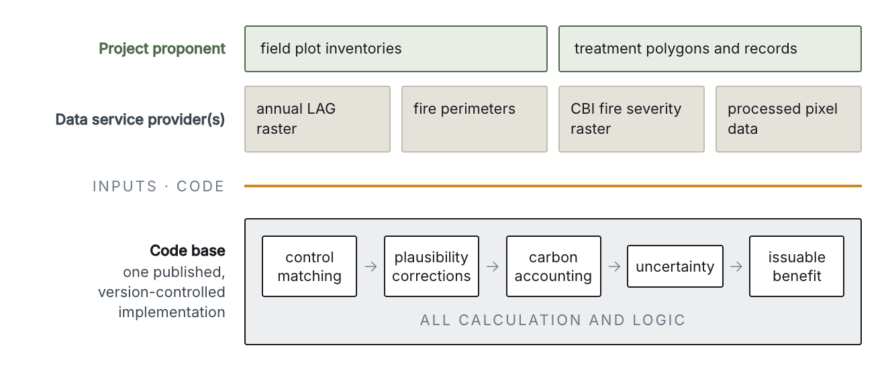

# 3 Applicability Conditions

This approach applies to forest restoration and fuel-reduction treatments in fire-adapted forests that have departed from their historical fire regimes. It applies under all of the following conditions:

1. The project occurs in natural forests — forests that regenerate predominantly through natural processes; planted forests managed primarily for timber production are excluded.
2. The project area historically supported a frequent, low- to mixed-severity fire regime (e.g. Fire Regime Group I or III) and has since departed from it, producing fuel conditions outside the natural range of variability (Landres et al. 1999; Keane et al. 2009).
    a. Departure is demonstrated quantitatively for the same forest type and region, using a fire-return-interval departure metric — percent FRI departure by severity class where available, or the current mean fire return interval (mFRI) versus the reference (pre-suppression) interval — corroborated by plot inventory showing current stand density (e.g., basal area or stand density index) above the reference range for the forest type. Peer-reviewed literature may update the reference interval.
3. Planned activities target the composition and arrangement of forest fuels so as to reduce wildfire risk and intensity (Agee & Skinner 2005). Any activity meeting this functional test is eligible, including hand or mechanical thinning, mastication, cultural and prescribed fire, managed wildfire implemented under an approved response strategy and project treatment plan, and targeted biomass removal.
4. A fuel-treatment plan covering the entire project area is prepared and approved by a qualified forestry professional (e.g., a Society of American Foresters Certified Forester or national/regional equivalent), identifying the eligible activities and their treatment schedule.

## 3.1 Conditions for the Performance Method

The performance method applies only where the applicability and exclusion conditions are met and sufficient untreated support is available to establish and monitor a valid benchmark.

The performance method runs where all of the following hold:

1. The same approved LAG product and processing workflow are applied to the project area and candidate control pool.
2. Sufficient untreated candidate pixels are available within the applicable ecological and geographic scope to satisfy the candidate-pool, matching, minimum-sampling, and distributional-equivalence requirements in Section 6.
3. Project and control pixels are assigned to the same fixed accounting strata supplied to the accounting in Sections 10 and 11.
4. The project maintains the geospatial, treatment, wildfire, and disturbance records needed to identify eligible support and event timing throughout the crediting period.

## 3.2 Rationale

The rationale for each applicability condition follows.

| Applicability condition | Rationale |
|---|---|
| The project occurs in natural forests. | The intent is to keep forests as forests. In overstocked, fire-prone forests, fuel-reduction treatments are the primary mechanism to restore forest structure and allow fire to play an ecologically productive role. Fuel reduction includes live tree and biomass removal, but treatments must maintain forest and may not convert forest to non-forest. |
| The project area historically supported a frequent, low- to mixed-severity fire regime (e.g., Fire Regime Group I or III), and its departed fire regime produces fuel conditions outside the natural range of variability (Landres et al. 1999; Keane et al. 2009). Departure is demonstrated quantitatively for the same forest type and region using a fire-return-interval departure metric, corroborated by plot inventory showing current stand density above the reference range. | A quantitative, science-backed threshold for demonstrating departure, so crediting is limited to forests that have moved outside their natural range of variability rather than forests still within it. |
| Planned activities target the composition and arrangement of forest fuels to reduce wildfire risk and intensity (Agee & Skinner 2005). Any activity meeting this functional test is eligible (e.g., hand or mechanical thinning, mastication, cultural and prescribed fire, targeted biomass removal). | An explicit requirement to effectively reduce the risk of high-severity fire while acknowledging and encouraging prescribed fire and the return of natural fire. Fire exclusion is not the goal; activities such as early detection are not eligible because they continue the fire-suppression cycle that has increased high-severity fire risk. The functional test credits the reduced probability and severity of future carbon loss, not avoided timber harvest. |
| A qualified forestry professional (e.g., a Society of American Foresters Certified Forester or national or regional equivalent) approves a fuel-treatment plan that covers the entire project area; the plan identifies eligible activities and their treatment schedule. | Independent professional assurance that the treatment design suits the forest type and fire regime, supporting the credibility of the project scenario at validation and giving independent verification a defined plan to check implementation against. |

Any activity that targets the composition and arrangement of forest fuels to reduce wildfire risk and intensity qualifies; the examples in condition 3 illustrate the functional test rather than bound it. The appropriate treatment depends on forest type, slope, access, fuel profile, ownership, operational constraints, and ecological objectives.

## 3.3 Supporting Documentation

Table 3-1. Documentation supporting fire-adapted-forest applicability.

| Applicability topic | Documentation examples |
|---|---|
| Fire as an ecological process | Fire-history studies, LANDFIRE or equivalent fire-regime products, local ecological literature, agency assessments |
| Departure from resilient condition | Forest inventory, remote-sensing structure products, fuel assessments, management plans, departure assessments |
| Wildfire hazard and risk | Wildfire-hazard modeling, recent analog fires, severity maps, biomass-loss evidence, control-area outcomes |
| Restoration-aligned treatment | Treatment prescriptions, silvicultural rationale, prescribed-fire plans, habitat considerations |

# 4 Project Boundary

## 4.1 Spatial Boundary

The project boundary is the treated forest area, delineated via a set of pixels used throughout the accounting. Creditable area is determined per pixel under the Section 3 Applicability Conditions (only qualifying pixels; at least 60% of the proposed treatment area). The matched control area lies outside the project boundary but is spatially defined at project initiation (t = 0) and held constant for the project lifespan.

## 4.2 GHG Boundary

The carbon pools accounted for in the project boundary and as leakage are shown in Table 4-1. The greenhouse gas (GHG) sources and sinks accounted for, including as leakage, are shown in Table 4-2. Non-CO₂ combustion gases are excluded from both the baseline and the project. Evaluated with IPCC default emission factors for forest biomass burning, CH₄ and N₂O are de minimis relative to CO₂ at the scale of crediting. Because the approach credits reduced fire severity, baseline non-CO₂ emissions exceed project non-CO₂ emissions, rendering their exclusion conservative.

Table 4-1. Carbon pools accounted for in the project boundary and as leakage

| Carbon pool | Included? | Justification/Explanation |
|---|---|---|
| Aboveground woody biomass (trees and shrubs; LAG) | Yes | Major pool; changes materially with project activities. |
| Aboveground non-woody biomass | No | Conservative to exclude; de minimis. |
| Belowground woody biomass | No | Conservative to exclude; tracks aboveground and is not credited. |
| Belowground non-woody biomass | No | Conservative to exclude; de minimis. |
| Dead wood | Yes | Standing and downed dead woody material, affected by treatment and fire. Initialized from project field plots by fixed accounting stratum and propagated annually at the pixel level under Section 10, rather than estimated through inventory-based stock-change modules (e.g., VMD0002 under the VCS Program), because the accounting requires a continuously propagated pixel-level state rather than stock estimates at discrete measurement events. |
| Litter | No | Conservative to exclude; de minimis. |
| Soil organic carbon (SOC) | No | Conservative to exclude; treatment effect slow and uncertain. |
| Wood products | Optional | Exclusion permits crediting of removed biomass under a separate biomass-utilization methodology (e.g., VM0044 under the VCS Program). |

Table 4-2. GHG sources and sinks accounted for as baseline, project, and leakage emissions

| Scenario | Source/Sink | Type | Gas | Included? | Justification/Explanation |
|---|---|---|---|---|---|
| Baseline | Burning of biomass | Source | CO₂ | Yes | LAG loss from fire accounted as a carbon stock change. |
| Baseline | Burning of biomass | Source | CH₄ | No | Excluded as de minimis relative to CO₂, using IPCC default emission factors (IPCC 2006, Volume 4). |
| Baseline | Burning of biomass | Source | N₂O | No | Excluded as de minimis relative to CO₂, using IPCC default emission factors (IPCC 2006, Volume 4). |
| Baseline | Burning of biomass | Source | Other | No | No other GHGs. |
| Project | Burning of biomass | Source | CO₂ | Yes | LAG loss from fire accounted as a carbon stock change. |
| Project | Burning of biomass | Source | CH₄ | No | Excluded as de minimis relative to CO₂, using IPCC default emission factors (IPCC 2006, Volume 4). |
| Project | Burning of biomass | Source | N₂O | No | Excluded as de minimis relative to CO₂, using IPCC default emission factors (IPCC 2006, Volume 4). |
| Project | Burning of biomass | Source | Other | No | No other GHGs. |
| Project | Biomass disposal during treatment (pile burning, mastication) | Source | CO₂ | Yes | Removal and on-site disposal of biomass at treatment; immediate emission (Section 10). |
| Project | Biomass disposal during treatment (pile burning, mastication) | Source | CH₄ | No | Excluded as de minimis relative to CO₂, using IPCC default emission factors (IPCC 2006, Volume 4). |
| Project | Biomass disposal during treatment (pile burning, mastication) | Source | N₂O | No | Excluded as de minimis relative to CO₂, using IPCC default emission factors (IPCC 2006, Volume 4). |
| Project | Biomass disposal during treatment (pile burning, mastication) | Source | Other | No | No other GHGs. |
| Project | Burning of fossil fuels | Source | CO₂ | No | Excluded as de minimis relative to CO₂ from the included carbon pools, using IPCC default emission factors (IPCC 2006, Volume 2). |
| Project | Burning of fossil fuels | Source | CH₄ / N₂O / Other | No | Excluded as de minimis relative to CO₂ from the included carbon pools, using IPCC default emission factors (IPCC 2006, Volume 2). |
| Leakage | Activity shifting / market effects | Source | All | No | Determined to be zero; treatments increase regional wood/biomass supply; no displacement beyond boundary (Section 12). |

***

# 5 Remote Sensing

## 5.1 Summary

This section provides the background supporting the remote sensing (RS), geospatial modeling, and fire-ecology concepts in this approach. It explains why remotely sensed estimates of forest carbon stocks and fire effects are appropriate here, what minimum evidence supports them, and how projects and reviewers should understand the ecological basis for applying the approach to fire-adapted forests.

Remote sensing is used in this approach because forest carbon outcomes, wildfire effects, and landscape-scale counterfactual conditions are spatially explicit phenomena. Wildfire is stochastic and heterogeneous — whether an area burns, and how severely, varies pixel to pixel and year to year — so the counterfactual requires a large, census-style control that sparse field plots cannot supply. Properly calibrated and validated remote sensing models provide a repeatable, spatially complete basis for estimating carbon stocks, tracking carbon stock change over time, identifying disturbance effects, and comparing project areas to matched untreated control areas.

The use of remote sensing in this approach is not based on the assumption that any single satellite product is perfectly accurate at every pixel. Rather, the approach relies on a structured measurement framework in which remote sensing products are used consistently over time, compared against independent field or reference data where required, evaluated for bias and uncertainty, and subject to conservative deductions or validity gates when model performance is insufficient. The defensibility of the approach therefore depends on model validation, consistent data processing, uncertainty quantification, and transparent documentation.

## 5.2 Role of Remote Sensing

The accounting variable is live aboveground carbon (LAG), in Mg C ha⁻¹ (or t CO₂e ha⁻¹ after conversion). Remote sensing performs three functions:

- Carbon stock and its annual change: estimate LAG for every project and control pixel in each year, and the change between consecutive annual observations.
- Fire severity: characterize fire occurrence and severity and the resulting carbon loss.
- Control-area selection and monitoring: select, match, and monitor the untreated pixels that establish the dynamic performance benchmark.

Sections 8 through 11.1 produce the corrected project and control annual LAG records, and Sections 11.2 and 13 difference them to give the project benefit after the Section 9 corrections are complete. Remote sensing supplies the two records; the difference between them is an accounting result rather than an observation.

Remote sensing is used because these quantities can be measured repeatedly and consistently across the entire project and control areas. This matters most for fire, whose effects are spatially heterogeneous: a single fire can include unburned, low-, mixed-, and high-severity patches that a plot-only design would need many plots to capture. A product is fit for purpose when it represents the LAG pool, has sufficient spatial and temporal resolution for the treatment and fire regime, is processed consistently over time, and can be validated against independent data.

## 5.3 Remote-Sensing Estimates of Biomass and Carbon Stocks

An RS product is fit for use when it meets the following.

**Target and units.** The product estimates live aboveground carbon (LAG), reported in t CO₂e ha⁻¹ (or Mg C ha⁻¹).

**Prediction support.** The product states its spatial support (pixel or grid cell) and temporal support (at least annual). Validation compares like with like: plot footprint, geolocation uncertainty, and spatial aggregation are reconciled before plots are compared to pixels.

**Data inputs.** Every remote-sensing product, covariate, and ancillary dataset used is listed. The combination method need not be disclosed, but every input is listed.

**Consistency through time.** The same product, processing chain, compositing logic, and resolution apply across project and control and over time. Any change in product or model version is documented and assessed for its effect on reported carbon.

**Calibration and validation.** The model is calibrated on data representative of the project's forest types, biomass range, and disturbance conditions, and validated on independent data. Bias, RMSE, MAE, variance explained, and prediction-interval coverage are reported, including performance by forest type or biomass class and before/after disturbance. The product detects biomass loss after high-severity fire and does not overstate post-treatment gains.

## 5.4 Remote-Sensing Estimates of Fire Severity

Fire severity is the ecological effect of fire (Keeley 2009); it drives tree mortality, combustion, delayed emissions, and long-term carbon change (Carlson et al. 2012). Severity may be measured with field metrics (Composite Burn Index, tree or basal-area mortality, canopy scorch, biomass loss) or with remotely sensed indices calibrated against those field measures (Parks et al. 2018). The index used suits the vegetation type, fire regime, and carbon-accounting purpose, with severity classes tied to carbon-relevant outcomes.

A fire-severity product is suitable only where documentation specifies: the fire perimeter or burned-area source; pre- and post-fire imagery dates or compositing windows; the spectral indices, covariates, or structural metrics used; the severity classes or continuous variable produced; the field or reference data used to interpret severity; evidence that the estimate suits the project forest type and region; and how severity uncertainty enters the accounting. Post-fire imagery timing is justified for the severity metric, since imagery acquired too soon emphasizes char and ash and imagery acquired later reflects delayed mortality or early recovery.

Composite Burn Index and related field measurements bridge remotely sensed fire effects and ecological interpretation. Field cross-checks confirm that mapped severity distinguishes fire effects that leave live overstory carbon intact from effects that cause large live-biomass loss or stand-replacing mortality. Where the product cannot reliably distinguish these outcomes in the project setting, the project adds data, applies a more conservative default, or excludes the affected area from the relevant crediting.

## 5.5 Minimum Viable Criteria for Remote Sensing in a New Geography

Application in a new geography requires evidence that the remote-sensing system produces reliable biomass and fire-severity estimates for the relevant forest types and disturbance regimes. The criteria in Table 5-1 apply.

Table 5-1. Minimum viable criteria for remote-sensing use.

| Criterion | Minimum expectation |
|---|---|
| Defined target variable | The biomass, carbon, or severity variable is defined, including pool, units, spatial support, and temporal support |
| Appropriate data | Imagery or structural data are available at resolutions suitable for the treatment and fire regime |
| Consistent time series | The same product, processing chain, compositing logic, and resolution across project and control and over time |
| Calibration data | The model is calibrated on data representative of the project's forest types, biomass ranges, and disturbance conditions |
| Independent validation | Model performance is evaluated on independent data |
| Bias assessment | Prediction error is evaluated for systematic bias overall and within project-relevant strata |
| Uncertainty quantification | Uncertainty is quantified and propagated to the scale of crediting |
| Disturbance sensitivity | The product detects wildfire effects and treatment-related biomass change |
| Fire-severity validation | Severity estimates are checked against field data or accepted severity products |
| Applicability domain | Prediction locations fall within the environmental and spectral domain where the model is valid |
| QA/QC and reproducibility | Data, code, model versions, processing steps, and outputs are archived and reproducible |

Four of the criteria in Table 5-1 carry required numerical thresholds:

- **Validation and bias.** Independent validation and bias assessment demonstrate RMSE-based model error below 20% of mean aboveground carbon density and a 90% confidence interval no greater than 10% of the mean, evaluated overall and within each credited stratum — the same agreement bar as Section 5.3.
- **Uncertainty.** Uncertainty is quantified, propagated to the scale of crediting, and applied one-sided in the credit-reducing direction.
- **Disturbance sensitivity.** The product detects biomass loss after high-severity fire, and its post-treatment gain is supported by independent before-and-after-disturbance data.
- **Fire-severity validation.** Mapped severity separates effects that leave live overstory carbon intact from effects causing large live-biomass loss or stand-replacing mortality, checked against field data such as the Composite Burn Index.

A stratum that fails any of these levels is treated as untested; credit for that stratum pauses until additional plots or a more conservative default bring it into agreement.

## 5.6 Documentation Expected for Remote-Sensing Models

Project documentation includes a remote-sensing validation report covering:

- the target variable;
- all products, covariates, ancillary datasets, and versions; preprocessing, feature engineering, masking, compositing, and spatial alignment;
- model architecture and justification; calibration data sources and sample sizes;
- validation data sources and sample sizes and evidence of their independence; performance statistics including bias and precision, summarized by forest type, biomass range, severity class, and treatment status;
- uncertainty estimation and propagation;
- any recalibration or version change; example covariates and output maps;
- and archived code sufficient to reproduce the estimates used for crediting.

For fire-severity models, the report also includes fire perimeters, pre- and post-fire image dates, severity classification rules, field or reference severity data, a severity accuracy assessment, and the relationship between mapped severity and carbon outcomes.

## 5.7 Severity-Class Combusted Fraction (p_CBI)

Table 5-2. Severity-class combusted fraction (p_CBI): the fraction of fire-killed LAG emitted immediately through combustion. The remainder transfers to the dead-wood pool and emits over time through decomposition (Section 10). Class breaks follow Miller & Thode 2007, with an unburned boundary at CBI = 0.1.

| CBI severity class | Range | p_CBI |
|---|---|---|
| No fire / unburned | CBI ≤ 0.1 | 0 |
| Low | 0.1 < CBI < 1.25 | 0.03 |
| Moderate | 1.25 ≤ CBI < 2.25 | 0.07 |
| High | CBI ≥ 2.25 | 0.13 |

p_CBI is the fraction of fire-killed live carbon that combusts during the fire itself. What burns scales with severity: foliage and fine branches at low severity, extending at high severity into bark, sapwood, and small-diameter stems consumed outright. The larger boles char and remain standing, and the carbon they hold reaches the atmosphere through the dead-wood pool as it decomposes (Section 10). That progression is why p_CBI is indexed by severity class rather than set as a single value.

p_CBI therefore determines when killed carbon is emitted rather than how much of it is emitted, and the approach bounds it well below whole-tree loss so that bole carbon already tracked in dead wood is not charged twice. Routing the bole fraction through decomposition also keeps the baseline conservative: charging it as immediate combustion would raise baseline fire emissions and, with them, the avoided-loss credit.

The values reconcile four lines of evidence: eddy-covariance records, operational fuel-consumption models, field combustion studies, and emission-inventory comparisons (Campbell et al. 2007; Dore et al. 2012; French et al. 2011; Sullivan et al. 2011; Harmon et al. 2022, which supplies the low bound). Published figures above this range include surface fuels and committed snag carbon, neither of which belongs in an immediate-combustion term. The values sit at the center of the immediate-combustion range rather than at its low end, because the conservatism in this parameter comes from routing the bole fraction to decomposition rather than from making p_CBI small.

## 5.8 LAG Product Replacement

Approved LAG products will be revised, superseded, or discontinued within a 20-year crediting period, and more than once within a 40-year project lifespan. This section governs the replacement of one approved LAG product by another; product versions and local recalibrations of a continuing product follow the local-updating rules in Section 9.

A replacement product becomes eligible when it meets the Section 5.5 minimum viable criteria in the project geography, documented under Section 5.6, and its archive supports restatement of the complete annual record from project initiation.

The replacement applies to everything or nothing: the full annual LAG record — every project and control pixel, from t = 0 through the current annual step — is restated with the new product before the new product is used for any accounting. Annual differencing under Section 8 always uses consecutive observations from a single product; a change in reported carbon at the switch is instrument, not forest.

At least three overlapping annual observations spanning the switch are produced with both products over the project and control areas, with inter-product bias reported by fixed accounting stratum. The switch is evaluated under Section 9 as a product-level update, applied symmetrically to project and control, with calibration data separate from validation data.

A product replacement changes the observation instrument, never the selection: the control mask, control pixels, and fixed accounting strata remain unchanged, and matching is not redone. Where the replacement product's saturation characteristics differ from the original's, stratum membership stays as fixed at validation, and the replacement's saturation-prone conditions are documented under Section 5.5 and handled through the Section 9 bounds.

After restatement, corrected values and field-anchor reconciliations are re-run chronologically from the first anchor under Section 9, and the standard verification rerun carries any change through the ledger and vintage allocation under Section 13. Replacements take effect only at a verification boundary, with the rationale documented and accepted at verification.

***

# 6 Baseline Scenario and the Dynamic Performance Benchmark

The baseline is a dynamic performance benchmark (DPB): project outcomes are compared to a fixed control area of matched, untreated pixels selected once at project initiation (t = 0) and held constant for the life of the project. The control area represents what would have occurred on comparable untreated land absent the project — including management and disturbance affecting that land over time — and anchors additionality. Steps to select and apply the control area are given in Sections 6.2 through 6.6.

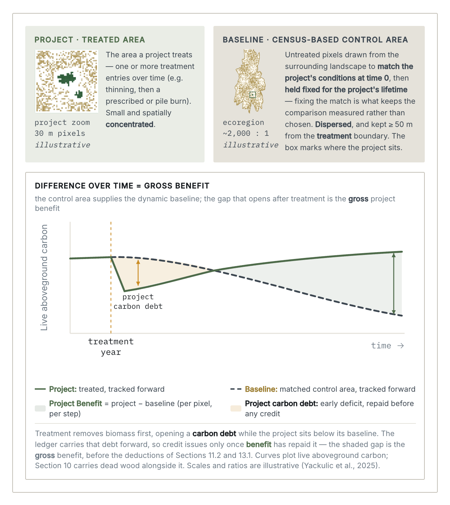

## 6.1 The Dynamic Performance Benchmark

The control area is a fixed group of untreated pixels matched using Section 6.4; it does not need to be contiguous. Annual LAG density (Mg C ha⁻¹) is observed in both the project and fixed control areas using the same approved remote-sensing product, and at each verification the annual LAG records are reconciled against the applicable field anchors under Section 9.

Control pixels are never removed, replaced, or reweighted, and open baseline-fire events remain in the dynamic benchmark — subject to the cumulative baseline-fire cap at each verification, and never triggering the project-fire area gate. The control mask, control pixels, and fixed accounting strata change only through a new, independently reviewed validation event; a LAG product replacement under Section 5.8 changes the observation instrument and is not such an event. Because the matched control set is fixed but re-observed annually, the DPB tracks wildfire, insects, disease, drought, and management in the counterfactual without outcome-based reselection: what is fixed is the selection, not the observation.

The disturbances the control experiences are the counterfactual: the outcomes the project area would have had without treatment. The benchmark is observation arranged as a natural experimental design (Fick et al. 2021), not a forecast.

## 6.2 Control Data Sources

The same data sources and preprocessing rules apply to the project area and candidate control pool; the attributes observed in the project area then mask and filter the candidates under Sections 6.3 and 6.4. Control selection draws on the following data, available at validation:

- approved remotely sensed LAG density, expressed in Mg C ha⁻¹, together with the applicable product validation report, biomass range, and saturation-prone conditions;
- project, treatment-area, and crediting-boundary masks;
- ecological region or an equivalent biophysical classification;
- existing vegetation or forest type;
- existing vegetation cover or an equivalent vegetation-structure classification;
- a regionally accepted wildfire-hazard metric for matching, and documented wildfire perimeters and CBI for monitoring; CBI is retained on its native 0–3 scale, with a fire event defined in Section 8 as CBI greater than 0.1;
- slope and, where material, elevation or aspect;
- road access or another operational-feasibility measure;
- surface-water or hydrologic proximity where it materially affects fire behavior, fuel moisture, or productivity;
- land management class (e.g., GAP stewardship status or a national equivalent); and
- spatial masks for non-forest pixels, project pixels, treatment buffers, known treatment areas, and other ineligible support.

For each dataset, the project documents the source, date, version, resolution, coordinate reference system, preprocessing, resampling, binning, and treatment of missing data. A substitute regional dataset may be used where its relevance and symmetric application are demonstrated.

## 6.3 Candidate Control Pool and Spatial Constraints

The candidate control pool consists of forest pixels that meet the applicability conditions, occur within the applicable ecological region, satisfy the same wildfire-hazard eligibility rule as project pixels, and do not overlap the project area or known treatment areas.

The following spatial rules apply:

- Project pixels are excluded from the candidate control pool.
- Pixels within 50 m of a project treatment boundary are excluded to reduce spillover and edge effects.
- After all filters are applied, the selected control area contains at least four times the project pixel count.
- The selected control mask is archived as a geospatial raster with its extent, resolution, coordinate reference system, and no-data value documented.

If adequate support cannot be obtained within the applicable ecological region, the project revises the design or expands the candidate pool only where ecologically justified; any alternative is subject to independent review. Matching requirements are never relaxed in response to post-validation outcomes.

## 6.4 Matching Covariates

Candidate control pixels satisfy Table 6-1. Eligibility and matching rules are fixed before control selection.

Table 6-1. Required matching covariates and default requirements.

| Covariate | Default requirement | Implementation requirement |
|---|---|---|
| Ecological region | Exact match | Project and control support occur within the same ecological region or an equivalent unit that represents comparable climate, composition, productivity, fire regime, and disturbance processes. |
| Existing vegetation or forest type | Exact or stratified match | Each broad project forest-type group is represented in the control. Exact-match categories may be pooled into the broad forest-type groups used to define fixed accounting strata where the Section 6.4.1 rules are met. Apply the full matching and balance procedure independently within each fixed accounting stratum. |
| Land management class (e.g., GAP stewardship status or national equivalent) | Exact or stratified match | Control pixels carry a management class comparable to the project's in harvest regime, suppression response, and treatment likelihood; classes may be grouped where regimes are demonstrably comparable, with the grouping documented. This criterion filters and stratifies the pool and does not enter the Section 6.5 bin combinations. |
| Wildfire hazard or equivalent risk metric | Eligibility filter and distributional match | Control pixels satisfy the project eligibility threshold and preserve a comparable hazard distribution. |
| Existing vegetation cover or equivalent structure metric | Binned distributional match | Use pre-specified 10-percentage-point bins, or an equivalent documented classification, and preserve the project distribution. |
| Pretreatment LAG density | Binned distributional match | Use pre-specified 5 Mg C ha⁻¹ bins and preserve the project distribution. |
| Slope | Range limit and distributional match | Exclude slopes greater than 50 degrees unless an alternative is justified. Retained distributions are comparable. |
| Distance to roads | Range limit and distributional match | Apply the project-specific accessibility limit and preserve a comparable road-distance distribution. |
| Distance to significant surface water | Distributional match where material | Where hydrologic proximity is material, project and control distributions are comparable. |

Slope and distance to roads together constitute operational feasibility: control pixels represent areas where treatment could plausibly occur under the approach's operational restrictions.

Matching pixels use fine bins and exact-match categories to preserve project-control comparability. They are control-selection units only and do not automatically become the fixed accounting strata used in Sections 10 and 11.

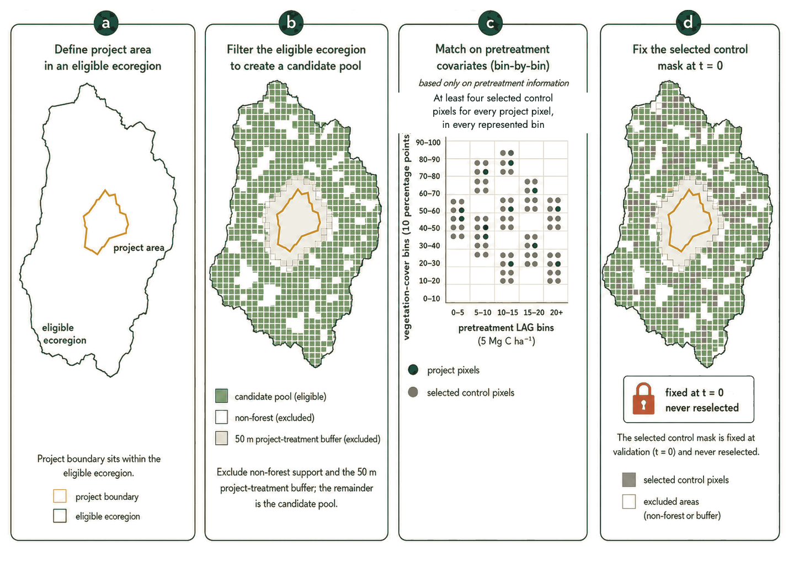

### 6.4.1 Fixed Accounting Strata

Fixed accounting strata are defined by broad pretreatment forest-type group and are no more detailed than necessary to distinguish material differences in field sampling, dead-wood initialization, decomposition parameters, or physical carbon accounting. Forest-type groups distinguish only broad compositional classes expected to differ materially in product performance, growth, treatment response, fire response, or dead-wood dynamics; minor types are assigned to the closest defensible group unless a material difference is demonstrated.

Run the complete Section 6 matching and balance procedure independently within each fixed accounting stratum. After control selection, identify saturation-prone baseline pixels individually from pretreatment product-validation or regional evidence. Those pixels remain within their fixed accounting stratum; Section 9.5 applies the baseline saturation response only to the pixels so identified.

Each project and control pixel is assigned to one fixed accounting stratum at validation. Stratum boundaries and membership remain fixed through treatment, wildfire, observed carbon outcomes, and crediting results.

## 6.5 Minimum Sampling Scalar

For each vegetation-cover bin k and pretreatment-LAG bin j represented in the project area, calculate the Minimum Sampling Scalar as:

$$ MSS_{k,j} = 0.25\left( \frac{n_{CA,k,j}}{n_{Proj,k,j}} \right) \qquad \text{(1)} $$

Where:

- `MSS_k,j` — Minimum Sampling Scalar for vegetation-cover bin k and pretreatment-LAG bin j
- `n_CA,k,j` — number of selected control pixels in bin combination (k, j)
- `n_Proj,k,j` — number of project pixels in the same bin combination

The approach requires MSS of at least 1.0 for every represented bin combination — equivalent to at least four selected control pixels for each project pixel in the selected bin combination. Bin combinations with no project pixels are not evaluated.

A bin combination that falls short of Equation (1) may be combined with an adjacent bin combination only under a pre-specified, ecologically justified rule, subject to independent review. All sampling and balance tests are then rerun on the revised matching bins or cell definitions; the fixed accounting strata do not change.

## 6.6 Distributional Equivalence and Standardized Mean Difference

At validation, the selected control area is tested for comparability to the project area on each required continuous matching covariate. The Standardized Mean Difference is calculated for covariate v as:

$$ SMD_{v} = \frac{{\overline{x}}_{Proj,v} - {\overline{x}}_{CA,v}}{s_{pooled,v}} \qquad \text{(2)} $$

Where:

- `SMD_v` — standardized mean difference for covariate v
- `x̄_Proj,v` — project-area mean for covariate v
- `x̄_CA,v` — selected-control-area mean for covariate v
- `s_pooled,v` — pooled standard deviation for covariate v

Equation (3) supplies the pooled standard deviation used as the denominator of Equation (2).

$$ s_{pooled,v} = \sqrt{\frac{s_{Proj,v}^{2} + s_{CA,v}^{2}}{2}} \qquad \text{(3)} $$

Where:

- `s_pooled,v` — pooled standard deviation for covariate v
- `s_Proj,v` — project-area standard deviation for covariate v
- `s_CA,v` — selected-control-area standard deviation for covariate v

The approach requires mean absolute SMD below 0.05 across the required continuous covariates, with no individual absolute SMD above 0.10 unless a written, independently reviewed justification supports it.

Validation documentation includes covariate means, standard deviations, MSS values, SMD values, categorical distributions, and plots of the principal continuous covariates.

***

# 7 Additionality

Additionality is demonstrated through a performance method: a regulatory-surplus test, a performance benchmark embedded in the dynamic baseline, and — where the project earns material non-carbon revenue — an investment barrier analysis following a recognized additionality tool (e.g., VT0008 Additionality Assessment under the VCS Program).

## 7.1 Regulatory Surplus

The project demonstrates regulatory surplus under the applicable crediting program's requirements. Credited activities cannot be required by law, regulation, or existing management plans; where treatment is legally mandated (e.g., defensible-space requirements, post-disturbance salvage), only activities exceeding those requirements are credited.

## 7.2 Performance Benchmark

Additionality is demonstrated quantitatively through the dynamic performance benchmark's natural-experimental design. At t = 0, a fixed control area of matched pixels is established, and both project and control areas are monitored throughout the crediting period; treatments or disturbances occurring in the control area are inherently represented in the benchmark. A project may issue credits only where all Section 9 corrected-value and accounting-closure requirements are complete and the completed project carbon statement exceeds the completed matched-baseline statement after the single joint residual uncertainty deduction and prior carbon debt. No separate paired project-control LAG significance test is required. Comparable treatments in the control area reduce the project-versus-baseline difference, lowering or eliminating creditable benefit.

### 7.2.1 Calculation and Relationship to Sections 8 through 13

This section defines no separate crediting equation. The fixed control area supplies the baseline observations and the project area supplies the project observations used in Sections 8 through 11.

Project and control observations are summarized independently within the fixed accounting strata. Sections 8 through 13 then:

- use the corrected annual project and baseline LAG records established under Section 9;
- complete annual pixel-level LAG and dead-wood physical accounting independently for project and baseline;
- summarize completed pixel-level states, emissions, and included-pool stock changes within the fixed accounting strata;
- apply both scenario densities to the corresponding creditable project stratum area and compare the project-total statements;
- calculate the gross project-versus-baseline benefit at the project scale;
- apply the single joint residual uncertainty deduction after all corrected-value and accounting-closure requirements are complete;
- update project-level carbon debt and determine issuance; and
- allocate issued benefit between removals and emission reductions and assign vintages.

There is no pixel-to-pixel project-control comparison and no separate stratum issuance floor. Stratum results remain unfloored until project-level aggregation under Section 11.

### 7.2.2 Benchmark Level Relative to Control Data

The benchmark level is zero project-versus-baseline benefit. A positive gross result means the completed project statement exceeds the completed baseline statement over the verification period.

A positive gross result is necessary but not sufficient for issuance: Sections 9 and 10 require complete corrected annual LAG records and accounting closure, Section 11 applies the single joint residual uncertainty deduction, and Section 13 applies prior carbon debt, the project-fire area gate, and the project-level issuance floor. Category allocation occurs only after total issuance is determined.

### 7.2.3 Conservativeness and Validation Failure

The main false-positive risk is confounding: the control differs from the project on characteristics that affect carbon outcomes independently of treatment, so part of the divergence between the two records is attributable to those characteristics rather than to the project. Matching addresses the observed part of that risk. Candidate pixels satisfy the same applicability conditions as the project under Section 6.3, are matched on the covariates in Table 6-1, meet the Minimum Sampling Scalar of Equation (1) — at least four selected control pixels for every project pixel in each bin — and satisfy the balance thresholds of Section 6.6. Fixing the mask at validation keeps the selection independent of outcomes, and using the same LAG product and processing chain for both areas keeps observation error common to the two records rather than specific to one.

If the candidate pool fails the Minimum Sampling Scalar or the balance requirements, the control area is invalid and is revised before validation. A failed matching test invalidates the control area rather than generating a credit deduction, and matching diagnostics stay out of the Section 13 ledger and the Section 11 joint residual uncertainty calculation.

### 7.2.4 Required Documentation and Ongoing Monitoring

The validation package includes:

- project, treatment, candidate-control, selected-control, buffer, exclusion, and fixed-stratum masks;
- the definition of each stratum and the data-source and preprocessing documentation required by Section 6.2;
- project and control pixel counts by bin combination and by fixed accounting stratum, MSS calculations, and continuous and categorical balance results;
- maps and distributional plots, approved deviations, and verification records required by Section 9.

## 7.3 Investment Analysis

Where the project generates material revenue other than carbon credits (e.g., timber or biomass sales), the project conducts an investment barrier analysis consistent with a recognized additionality tool (e.g., VT0008), demonstrating that carbon revenue is necessary for financial viability. The analysis is supported by verifiable financial documentation and shows that, without carbon revenue, the project would not proceed — owing to an insufficient expected rate of return or inability to secure financing.

***
# 8 Observation and the Corrected-Value Interface

Sections 8 through 13 turn annual remote-sensing observations into issued credits. This section defines the raw observations and the interface their corrections flow through; Section 9 tests and corrects them against field evidence; Sections 10 and 11 run the physical accounting and aggregate it to the project scale; Section 12 states leakage; Section 13 issues, allocates, and assigns vintages.

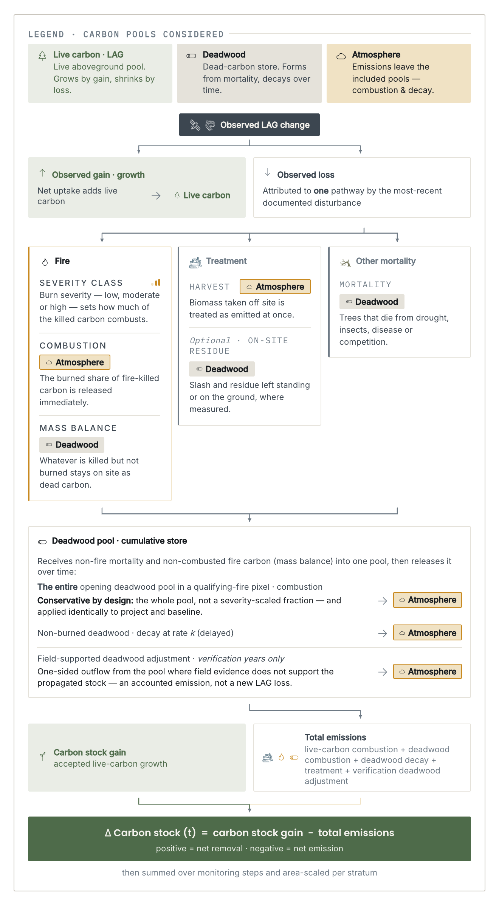

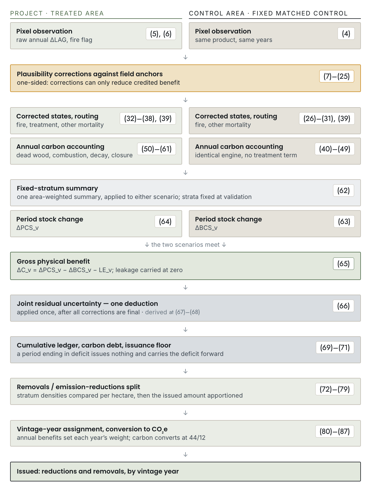

## 8.1 The Corrected-Value Interface

Table 8-1 is the authoritative interface between the observations defined in this section, the corrections in Section 9, and the accounting in Sections 10 and 11. Sections 8, 10, and 11 give the order of calculation; Section 9 supplies the corrected annual values.

Section 9 sets the corrected annual changes before the corrected states are propagated under Equations (27) and (33). Starting from the preceding field anchor, each year is calculated in order, so that every physical limit is applied against the corrected opening LAG. Where no Section 9 correction changes the annual sign or magnitude, the corrected annual change and pathway equal the provisional values derived from Equations (4) and (5) and the disturbance record.

Table 8-1. The corrected-value interface: each accounting input, its raw default, the Section 9 corrections that may adjust it, and its bound.

| Accounting input | Default annual value | Section 9 correction | Required bound or rule |
|---|---|---|---|
| `ΔLAG*_proj,i,t` | `ΔLAG^RS_proj,i,t` | treatment-step data-quality rule; project-fire floor; project endpoint-response reconciliation | closing corrected LAG must remain ≥ 0 |
| `ΔLAG*_bsl,i,t` | `ΔLAG^RS_bsl,i,t` | baseline-fire cap; baseline saturation response | closing corrected LAG must remain ≥ 0 |
| `LAG*_s,i,t` | prior corrected state plus corrected annual change | calculated chronologically from the preceding corrected field anchor after Section 9 finalizes the corrected annual changes | must not reset to raw RS stock after correction |
| `G*_s,i,t` | corrected annual change (growth) | changed only through the corrected annual state | cannot coexist with corrected loss in the same pixel-year |
| `L*_fire,s,i,t` | corrected annual loss (fire-induced) | project-fire floor or baseline-fire cap | no greater than corrected opening LAG |
| `L*_trt,proj,i,t` | corrected annual loss (treatment-induced) | Section 9 may add a treatment-response shortfall; the project-fire floor may increase this loss only where a later treatment controls the annual pathway | no greater than corrected opening LAG |
| `L*_other,s,i,t` | corrected annual loss (other non-fire mortality) | project endpoint residual may increase project other mortality | no greater than corrected opening LAG |
| `R_trt,proj,i,t` | zero (treatment residue retained on site) | direct treatment-residue evidence only | `0 ≤ R_trt ≤ L*_trt` |
| `I_fire,i,t` and `p_CBI,i,t` | fire perimeter, CBI, and Section 5 values | no endpoint correction | occurrence is independent of annual LAG-loss pathway |
| `DW_s,i,t` | Section 10 annual recurrence | project dead wood is subject to the one-sided verification correction in Section 9 | must remain nonnegative |
| `E_DW-adj,proj,i,t` | zero | one-sided project dead-wood correction at verification only | no greater than project dead wood available before the adjustment |

## 8.2 Baseline Observation

Baseline pixel observations are drawn from the fixed matched control area established under Section 6. The disturbance record assigns each pixel-year a provisional loss pathway — fire, treatment, or other non-fire mortality — using the most recent disturbance event in the annual observation interval.

Equation (4) calculates the raw annual change in baseline LAG as the difference between consecutive remote-sensing observations.

$$ \Delta LAG_{bsl,i,t}^{RS} = LAG_{bsl,i,t}^{RS} - LAG_{bsl,i,t - 1}^{RS} \qquad \text{(4)} $$

Where:

- `ΔLAG^RS_bsl,i,t` — raw remotely sensed annual baseline LAG change in pixel i from t−1 to t (Mg C ha⁻¹)
- `LAG^RS_bsl,i,t` — raw remotely sensed baseline LAG density in pixel i at year t (Mg C ha⁻¹)
- `LAG^RS_bsl,i,t−1` — raw remotely sensed baseline LAG density in pixel i at year t−1 (Mg C ha⁻¹)
- `i` — pixel index
- `t` — calendar-year accounting step

## 8.3 Project Observation

Project observations are drawn from the project area using the same approved annual remote-sensing product and processing workflow applied to the baseline.

Equation (5) calculates the raw annual change in project LAG as the difference between consecutive remote-sensing observations.

$$ \Delta LAG_{proj,i,t}^{RS} = LAG_{proj,i,t}^{RS} - LAG_{proj,i,t - 1}^{RS} \qquad \text{(5)} $$

Where:

- `ΔLAG^RS_proj,i,t` — raw remotely sensed annual project LAG change in pixel i from t−1 to t (Mg C ha⁻¹)
- `LAG^RS_proj,i,t` — raw remotely sensed project LAG density in pixel i at year t (Mg C ha⁻¹)
- `LAG^RS_proj,i,t−1` — raw remotely sensed project LAG density in pixel i at year t−1 (Mg C ha⁻¹)
- `i` — pixel index
- `t` — calendar-year accounting step

## 8.4 Fire Events

A fire event is a documented fire — wildfire, prescribed fire, cultural fire, or managed wildfire — whose perimeter overlaps the pixel and whose severity exceeds CBI 0.1 in that pixel. All four types follow the same fire accounting rules, whether or not the fire was a project activity. The fire-event indicator is defined independently of annual LAG-loss attribution.

Equation (6) identifies whether a fire event occurred in the pixel-year, independently of the pathway assigned to annual LAG loss.

$$ I_{fire,i,t} = \begin{cases} 1, & \text{fire perimeter overlaps pixel }i \land {CBI}_{i,t} > 0.1 \\ 0, & \text{otherwise} \end{cases} \qquad \text{(6)} $$

Where:

- `I_fire,i,t` — fire-event occurrence indicator for pixel i and year t
- `CBI_i,t` — Composite Burn Index for pixel i and year t
- `1{·}` — indicator function equal to one when the stated condition is true and zero otherwise
- `i` — pixel index
- `t` — calendar-year accounting step

***

# 9 Plausibility Corrections

This section establishes the corrected annual LAG records and the one-sided project dead-wood adjustment used in Sections 10 and 11. It tests whether remotely sensed project and baseline records are conservative over each interval bounded by corrected field observations, constrains fire responses using independent CBI-based mortality evidence, addresses baseline saturation, and supplies the inputs to the project-level joint residual uncertainty deduction in Section 11.

Sections 10 and 11 propagate the carbon pools and calculate issued benefit; Section 13 operates the carbon-debt ledger and applies the project-fire area gate. This section supplies the corrected records those operations run on. Two separate conditions stand between a verification and an issued credit. This section governs the first — whether the corrected record closes and is supported by field evidence, including completion of every project-fire event that has reached its endpoint. Section 13 governs the second — whether the project has recovered any carbon debt its treatments created and whether pre-endpoint unresolved moderate- and high-severity project-fire area exceeds 10% of the total creditable project area. A project can satisfy one and fail the other.

Annual remote-sensing observations remain the wall-to-wall source data. Field measurements are required at validation and at each verification and issuance event. No separate post-treatment or post-fire field visit is required. When verification evidence changes a corrected record, all affected annual LAG states and dependent Section 10 physical-accounting results are rerun from the preceding corrected field anchor.

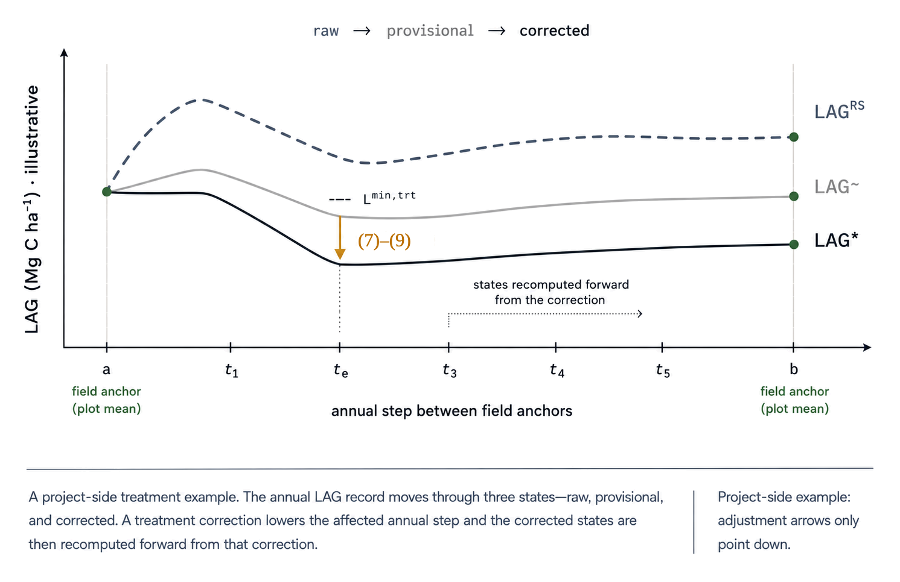

## 9.1 Field Anchors and Evidence

A corrected field anchor is a field inventory used to evaluate remotely sensed change over the same LAG pool, spatial support, and dates. Field anchors are required at validation and each verification and issuance event. The field-anchor interval r extends from the preceding corrected field anchor a to the current field anchor b.

Field-based plot measurement means of live aboveground carbon ("plot means") follow the approved sampling design. Remote-sensing values are sampled over the corresponding plot footprints and observation dates. Where field measurements occur within a calendar year, the monitoring plan specifies the approved annual compositing date or interpolation convention used to align plot and remote-sensing observations.

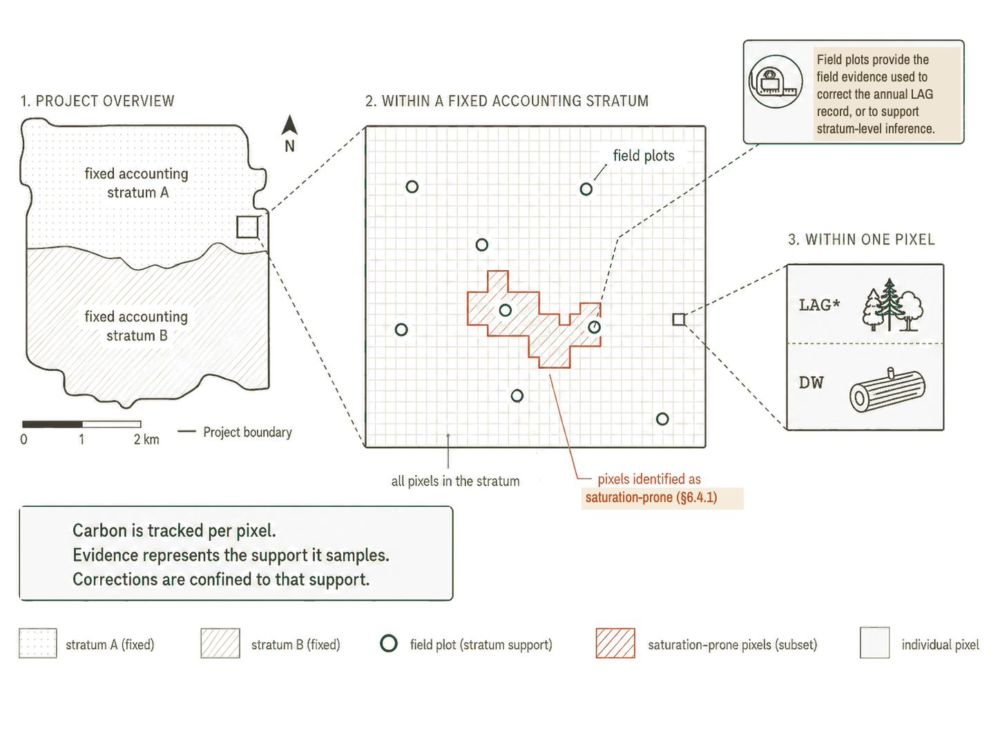

## 9.2 Treatment-Step QA

The treatment year is the first annual step where remote sensing observes the documented treatment. The treatment-response window includes that step and the next complete annual step. It ends earlier if another disturbance event occurs. This test applies only to treatments expected to remove live woody biomass. Prescribed fire, cultural fire, and managed wildfire follow Section 9.4.

Before reviewing post-treatment remote-sensing results, assign each treated pixel a minimum treatment loss using the approved treatment records and pretreatment LAG. Pixels in the same treatment unit may share a value, but test each pixel separately. Use a conservative lower bound, `L^min,trt_proj,i,e`, supported by documented biomass removal and the approved treatment records. Set it to zero for a treatment not expected to remove live woody biomass.

Equation (7) calculates the corrected treatment loss recorded during the treatment-response window as the maximum decline from the provisional corrected opening LAG in the treatment-affected annual step to the lowest provisional corrected LAG state reached during the window.

$$ L_{proj,i,e}^{*,trt,W} = \max\left( 0,{\widetilde{LAG}}_{proj,i,t_{e} - 1} - \min_{t \in W_{i,e}^{trt}}{\widetilde{LAG}}_{proj,i,t} \right) \qquad \text{(7)} $$

Where:

- `L*^trt,W_proj,i,e` — corrected treatment loss recorded for project pixel i and treatment event e during the treatment-response window (Mg C ha⁻¹)
- `W^trt_i,e` — treatment-response window for project pixel i and treatment event e
- `LAG~_proj,i,te−1` — provisional corrected project LAG available at the opening of the treatment-affected annual step (Mg C ha⁻¹)
- `LAG~_proj,i,t` — provisional corrected project LAG state at the close of annual step t before the treatment-response correction (Mg C ha⁻¹)
- `i` — pixel index; `e` — treatment-event index; `t` — calendar-year accounting step

Equation (8) calculates the discrepancy, if any, between the loss recorded during the window and the pixel's minimum treatment loss.

$$ C_{proj,i,e}^{trt} = \max\left( 0,L_{proj,i,e}^{min,trt} - L_{proj,i,e}^{*,trt,W} \right) \qquad \text{(8)} $$

Where:

- `C^trt_proj,i,e` — additional treatment loss required for project pixel i and treatment event e (Mg C ha⁻¹)
- `L^min,trt_proj,i,e` — approved minimum treatment loss for project pixel i and treatment event e (Mg C ha⁻¹)
- `L*^trt,W_proj,i,e` — corrected treatment loss recorded during the treatment-response window under Equation (7) (Mg C ha⁻¹)
- `max(0,·)` — function returning zero or the positive difference shown

If Equation (8) is positive, add that difference to the treatment-affected annual step. Equation (9) does this by reducing the corrected annual change in that step by the same amount.

$$ \Delta LAG_{proj,i,t_{e}}^{*,corr} = \Delta LAG_{proj,i,t_{e}}^{*,pre} - C_{proj,i,e}^{trt} \qquad \text{(9)} $$

Where:

- `ΔLAG*^corr_proj,i,te` — corrected signed annual project LAG change in the treatment-affected step after the treatment correction (Mg C ha⁻¹)
- `ΔLAG*^pre_proj,i,te` — corrected signed annual project LAG change in the treatment-affected step before the treatment correction (Mg C ha⁻¹)
- `C^trt_proj,i,e` — additional treatment-attributable LAG loss required under Equation (8) (Mg C ha⁻¹)
- `t_e` — annual step that brackets the documented treatment

Use the corrected annual change from Equation (9) in all later Section 9 and Section 10 steps. Treat the treatment-affected step as a treatment-loss year: corrected gain and the fire and other-mortality loss pathways are zero. The loss cannot exceed the corrected opening LAG under Equation (39). Equation (54) treats it as a treatment emission, while Equation (55) transfers only measured retained residue to dead wood.

## 9.3 Local Updating

The approved LAG product may be used as published, bias-corrected locally, or locally retrained. Any update applies symmetrically to the project area, the candidate control pool, the fixed control area, and every annual observation required for the affected verification interval. Calibration data used to fit a local update are separate from data used to validate that update. Replacement of one approved product by another follows Section 5.8.

## 9.4 Fire-Response Plausibility

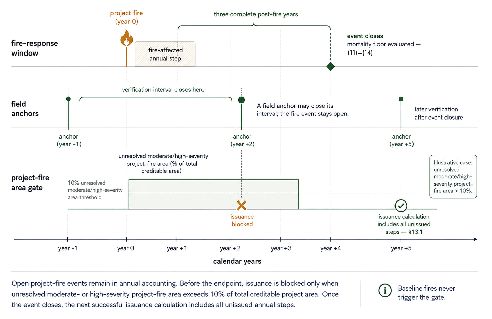

### 9.4.1 CBI-Based Cumulative Mortality Bounds

CBI describes fire severity within the burned area. An approved CBI-to-mortality relationship converts that severity into the cumulative fraction of corrected pre-fire LAG expected to be dead or otherwise lost from the live pool by the end of the third complete post-fire year. The same relationship provides two conservative bounds (Table 9-1), but they are applied differently. For a project fire, it establishes the minimum cumulative mortality (`m^min_h,c`) that must be recognized when the event closes. For a baseline fire, it establishes the maximum cumulative mortality (`m^max_h,c`) that may be counted, which is checked at each verification and again when the event closes. These bounds are separate from p_CBI, which represents only the fraction of corrected fire-attributable live loss combusted immediately during the fire. Requiring a minimum project-fire loss while limiting baseline-fire loss prevents the project from overstating its net climate benefit. Where an approved regional or forest-type relationship is unavailable, the default values in Table 9-1 apply. Regional alternatives define the same three-year cumulative endpoint and document the field or model evidence, CBI calibration, forest type, biomass range, and uncertainty basis. Each lower bound lies between zero and the corresponding upper bound, and no upper bound exceeds one.

Table 9-1. Methodology-default cumulative mortality bounds after three complete post-fire years, by CBI class.

| CBI severity class | CBI range | `m^min_h,c` | `m^max_h,c` |
|---|---|---|---|
| No fire event | ≤ 0.1 | 0 | 0 |
| Low | 0.1 < CBI < 1.25 | 0.00 | 0.30 |
| Moderate | 1.25 ≤ CBI < 2.25 | 0.10 | 0.75 |
| High | CBI ≥ 2.25 | 0.65 | 0.95 |

If a superseding disturbance or the end of the crediting period truncates a project-fire response before the default endpoint, approved event-specific endpoint evidence is required; the project-fire default may not be prorated or applied early.

### 9.4.2 Maximum Cumulative Remotely Sensed Decline

For a fire event e, define the remotely sensed maximum cumulative decline from the corrected pre-fire state through the fire-response window:

$$ M_{s,i,e,v}^{RS} = \max\left\lbrack 0,LAG_{s,i,e - 1}^{*} - \min_{t \in F_{e,v}}{\widetilde{LAG}}_{s,i,t} \right\rbrack \qquad \text{(10)} $$

Where:

- `M^RS_s,i,e,v` — maximum cumulative corrected LAG decline for scenario s, pixel i, fire event e, and verification v (Mg C ha⁻¹)
- `LAG*_s,i,e−1` — corrected pre-fire LAG state for scenario s and pixel i (Mg C ha⁻¹)
- `LAG~_s,i,t` — provisional corrected LAG state for scenario s and pixel i after all earlier Section 9 adjustments in the required order and before application of the fire floor or cap (Mg C ha⁻¹)
- `F_e,v` — set of annual steps in the fire-response window for event e that are available at verification v
- `s` — scenario indicator; bsl for baseline or proj for project
- `i` — pixel index; `e` — fire-event index; `t_e` — fire-affected calendar-year accounting step for event e; `v` — verification period; `t` — calendar-year accounting step

The fire-response window begins with the fire-affected annual step and ends at the close of the third complete post-fire year. Apply Equation (10) to a baseline fire at each verification using the annual observations available through that date. Apply it to a project fire when the event closes. Until a project fire closes, its annual values remain provisional only for the project-fire floor and remain in annual project accounting. Baseline annual values remain in the fixed baseline and are subject to the cumulative cap at each verification.

At each baseline verification, use the years observed to date to enforce the baseline cap. Complete these Section 9 checks before Section 10 is calculated. If a later disturbance event ends the project-fire window early, the endpoint requires approved evidence; otherwise, the event remains unresolved for the Section 13.1 project-fire area gate.

Equation (10) uses the lowest corrected annual LAG state in the response window rather than the state at the end of the window. Regrowth after the largest decline can raise LAG and would therefore cause the end-of-window state to understate the observed fire response. The result is the largest observed cumulative net decline in LAG, not a measurement of gross mortality. Where mortality and regrowth occur within the same annual step, gross mortality may exceed the observed decline.

### 9.4.3 Project-Fire Mortality Floor

$$ M_{proj,i,e}^{floor} = m_{h,c}^{\min}LAG_{proj,i,e - 1}^{*} \qquad \text{(11)} $$

Where:

- `M^floor_proj,i,e` — minimum cumulative project-fire mortality required by the applicable CBI class at the approved endpoint (Mg C ha⁻¹)
- `m^min_h,c` — conservative lower cumulative mortality fraction for stratum h and CBI class c
- `LAG*_proj,i,e−1` — corrected project LAG state immediately before fire event e (Mg C ha⁻¹)
- `t_e` — fire-affected calendar-year accounting step for fire event e; `h` — fixed accounting stratum; `c` — CBI severity-class index

Equation (12) is used only when the provisional decline over the fire-response window does not meet the project-fire mortality floor. It reduces the final eligible post-fire state to the required endpoint: corrected pre-fire LAG less the mortality floor. Because the adjustment is measured from the provisional final state, it also accounts for any recovery or net gain that occurred before the response event closed.

$$ b_{pfire,i,e,v} = \mathbf{1}\left\{ M_{proj,i,e,v}^{RS} < M_{proj,i,e}^{floor} \right\}\left\lbrack {\widetilde{LAG}}_{proj,i,t_{f}(e,v)} - \left( LAG_{proj,i,t_{e} - 1}^{*} - M_{proj,i,e}^{floor} \right) \right\rbrack \qquad \text{(12)} $$

Where:

- `b_pfire,i,e,v` — total downward adjustment to corrected closing project LAG in the final eligible post-fire annual step for pixel i, fire event e, and verification period v (Mg C ha⁻¹)
- `M^RS_proj,i,e,v` — maximum cumulative provisional corrected project LAG decline for pixel i and fire event e through verification v, per Equation (10) (Mg C ha⁻¹)
- `M^floor_proj,i,e` — minimum cumulative project-fire mortality required by Equation (11) (Mg C ha⁻¹)
- `LAG~_proj,i,tf_e,v` — provisional corrected project LAG state at the close of the final eligible post-fire annual step, after earlier required adjustments and before Equation (12) (Mg C ha⁻¹)
- `LAG*_proj,i,te−1` — corrected project LAG state immediately before the fire-affected step t_e (Mg C ha⁻¹)
- `tf_e,v` — final eligible post-fire annual step in the completed fire-response window at event closure
- `1{·}` — indicator function equal to one when the stated condition is true and zero otherwise

Equation (13) applies the full downward adjustment to the corrected closing LAG state in the final eligible post-fire annual step.

$$ LAG_{proj,i,t_{f}(e,v)}^{*} = {\widetilde{LAG}}_{proj,i,t_{f}(e,v)} - b_{pfire,i,e,v} \qquad \text{(13)} $$

Equation (14) is the required project-fire endpoint closure check: after the corrected annual states have been updated chronologically, it requires the response-window record to show a cumulative decline at least as large as the applicable mortality floor.

$$ \max\left\lbrack 0,\; LAG_{proj,i,t_{e} - 1}^{*} - \min_{t \in F_{e,v}}LAG_{proj,i,t}^{*} \right\rbrack \geq M_{proj,i,e}^{floor} \qquad \text{(14)} $$

Equations (12) through (14) are evaluated once, when the fire-response event closes. The final eligible step occurs after the fire-affected annual step. Where the provisional decline already meets or exceeds the floor, the indicator in Equation (12) is zero and no adjustment is applied. Where an adjustment is required, Equation (12) moves the provisional final-step state to the required endpoint state, including any recovery after the response-window minimum and any net gain above the corrected pre-fire state. Equation (13) therefore cannot merely erase an intervening gain while leaving the floor unmet.

Calculate the corrected annual change in the final eligible step from its corrected opening and corrected closing states. Gain and loss cannot coexist. Assign the entire resulting corrected loss under the most-recent-disturbance rule: to fire where the original fire remains the most recent disturbance event, or to treatment where a later treatment is the most recent disturbance event. Set the other loss pathways to zero. For fire-attributable delayed mortality, I_fire,i,t = 0 and p_CBI,i,t = 0. The resulting loss enters dead wood through Equation (55), does not combust opening dead wood, and is not treated as immediate live-carbon combustion under Equation (51).

Starting from the corrected pre-fire state, update the affected annual LAG states in year order and check Equation (14) again. If the lower opening state leaves a later corrected loss above the available LAG, cap that loss at the revised opening state under Equation (39) and keep its single pathway. Repeat this check after any later one-sided correction. The final corrected values then enter Section 10. A project-fire event cannot close, and the verification period containing its final eligible post-fire step cannot issue, unless Equation (14) and all pixel-level mass-balance checks close.

If no eligible post-fire step exists because the response window is truncated, the default floor is not applied early. Approved event-specific endpoint evidence specifies the corrected endpoint and dead-wood transfer before the event can close for issuance.

If the required CBI evidence, applicable mortality bound, or corrected annual project LAG record cannot be established and reproduced, the project-fire event remains unresolved. Unless an approved conservative default resolves the missing evidence, affected project area is treated as moderate or high severity for the Section 13.1 project-fire area gate while the event remains before its endpoint.

### 9.4.4 Baseline-Fire Mortality Cap

$$ M_{bsl,i,e}^{cap} = m_{h,c}^{\max}LAG_{bsl,i,e - 1}^{*} \qquad \text{(15)} $$

Where:

- `M^cap_bsl,i,e` — maximum cumulative baseline-fire mortality allowed by the applicable CBI class at the approved endpoint (Mg C ha⁻¹)
- `m^max_h,c` — conservative upper cumulative mortality fraction for stratum h and CBI class c
- `LAG*_bsl,i,e−1` — corrected baseline LAG state immediately before fire event e (Mg C ha⁻¹)
- `t_e` — fire-affected calendar-year accounting step for fire event e; `h` — fixed accounting stratum; `c` — CBI severity-class index

At each verification, let the minimum permitted corrected baseline LAG through the observed portion of the response window equal the corrected pre-fire LAG minus the cumulative mortality cap. At the first annual step whose provisional closing LAG falls below the minimum, reduce the corrected loss in that step by the amount required to set closing LAG equal to the minimum, then propagate the revised state forward. Repeat this check at each later step that would otherwise fall below the minimum. A loss may be reduced to zero, but the cap never creates corrected gain. The final corrected annual record satisfies the cumulative cap through the observed portion of the response window, and the test is repeated at event closure.

## 9.5 Baseline Saturation Response

The saturation response applies only to the pixels identified as saturation-prone under Section 6.4.1, from the approved product validation report and, where available, region-specific evidence.

Where suitable untreated reference plots are available, use:

$$ {\widehat{D}}_{sat,h,r} = \left( {\overline{LAG}}_{bsl,h,b}^{plot} - {\overline{LAG}}_{bsl,h,a}^{plot} \right) - \left( {\overline{\widetilde{LAG}}}_{bsl,h,b} - {\overline{\widetilde{LAG}}}_{bsl,h,a} \right) \qquad \text{(16)} $$

Where:

- `D̂_sat,h,r` — estimated credit-favorable baseline saturation discrepancy for stratum h and interval r (Mg C ha⁻¹)
- `LAḠ^plot_bsl,h,b`, `LAḠ^plot_bsl,h,a` — design-weighted untreated-reference plot LAG means for baseline stratum h at field anchors b and a (Mg C ha⁻¹)
- `LAḠ~_bsl,h,b`, `LAḠ~_bsl,h,a` — provisionally corrected baseline LAG means for stratum h at field anchors b and a (Mg C ha⁻¹)
- `h` — fixed accounting stratum; `r` — field-anchor assessment interval; `a`, `b` — opening and closing corrected field-anchor years for interval r

In Equation (16), the plot term is the design-weighted mean from approved untreated reference plots representing the pixels identified as saturation-prone within stratum h. The provisional remote-sensing means are area-weighted across those same pixels. The plots may occur in untreated portions of the project landscape or outside the project area and need not occur within the fixed control mask. The evidence represents the same forest type, pretreatment biomass or saturation range, ecological region, observation interval and dates, and remote-sensing product.

Untreated plots are not mandatory. Where adequate untreated reference plots are unavailable, `D̂_sat,h,r` may be estimated directly from the approved product-validation report, a regional validation dataset, or an approved saturation-response model that represents the same conditions and interval. The evidence source, transferability, and uncertainty are documented.

$$ b_{sat,h,r} = \max\left( 0,{\widehat{D}}_{sat,h,r} \right) \qquad \text{(17)} $$

Where:

- `b_sat,h,r` — nonnegative baseline saturation point correction for stratum h and interval r (Mg C ha⁻¹)
- `D̂_sat,h,r` — estimated credit-favorable baseline saturation discrepancy for stratum h and interval r (Mg C ha⁻¹)

A positive result means the provisionally corrected baseline record understates expected untreated growth and is therefore credit-favorable. The corrected annual allocation represents the complete area-weighted correction over the pixels identified as saturation-prone within the stratum and the field-anchor interval, as demonstrated by the following closure identity:

$$ \sum_{t = a + 1}^{b}{\sum_{i \in I_{bsl,h}}^{}a_{i}}\left( \Delta LAG_{bsl,i,t}^{*} - {\widetilde{\Delta LAG}}_{bsl,i,t} \right) = A_{bsl,h}b_{sat,h,r} \qquad \text{(18)} $$

Where:

- `a_i` — area represented by pixel i (ha)
- `ΔLAG*_bsl,i,t` — corrected signed annual baseline LAG change in pixel i during year t (Mg C ha⁻¹)
- `ΔLAG~_bsl,i,t` — provisional corrected annual baseline LAG change before the saturation correction (Mg C ha⁻¹)
- `I_bsl,h` — set of baseline pixels identified as saturation-prone (Section 6.4.1) in fixed stratum h
- `A_bsl,h` — area of the pixels identified as saturation-prone in fixed stratum h (ha)
- `b_sat,h,r` — nonnegative baseline saturation point correction for stratum h and interval r (Mg C ha⁻¹)
- `a`, `b` — opening and closing corrected field-anchor years for interval r; `t` — calendar-year accounting step

Allocate `b_sat,h,r` across the corrected signed annual baseline changes of the pixels identified as saturation-prone, using product- or region-specific predicted-growth weights where available. Where such weights are unavailable, allocate in the following deterministic order:

- increase existing corrected gains;
- convert zero annual changes to gain;
- reduce corrected losses toward zero; and, if correction remains,
- cross zero so that the pixel-year becomes a gain year.

Weights determine allocation within each stage. Each corrected pixel-year retains one net sign. Where a correction reduces a loss to zero or crosses zero, set all corrected loss-pathway quantities for that pixel-year to zero; fire-event occurrence under `I_fire,i,t` remains unchanged. Update the annual baseline LAG states and pathways chronologically from field anchor a as needed to satisfy Equation (18). The final corrected values then enter the baseline physical-accounting equations in Section 10. If a valid correction or a closed corrected annual record cannot be established, verification cannot proceed to issuance until an approved product, local update, regional model, or conservative fallback resolves the deficiency.

## 9.6 Project Endpoint-Response Reconciliation

Apply the project endpoint test after the treatment correction in Section 9.2. The test asks whether the corrected annual project changes still overstate the total change in live carbon between the two field anchors.

$$ {\widehat{D}}_{resp,h,r} = \left( {\overline{\widetilde{LAG}}}_{proj,h,b} - {\overline{\widetilde{LAG}}}_{proj,h,a} \right) - \left( {\overline{LAG}}_{proj,h,b}^{plot} - {\overline{LAG}}_{proj,h,a}^{plot} \right) \qquad \text{(19)} $$

Where:

- `D̂_resp,h,r` — estimated credit-favorable project endpoint-response discrepancy for stratum h and interval r (Mg C ha⁻¹)
- `LAḠ~_proj,h,b`, `LAḠ~_proj,h,a` — provisionally corrected project LAG means for represented support at field anchors b and a (Mg C ha⁻¹)
- `LAḠ^plot_proj,h,b`, `LAḠ^plot_proj,h,a` — design-weighted project plot LAG means for represented support at field anchors b and a (Mg C ha⁻¹)
- `h` — fixed accounting stratum; `r` — field-anchor assessment interval; `a`, `b` — opening and closing corrected field-anchor years for interval r

$$ b_{resp,h,r} = \max\left( 0,{\widehat{D}}_{resp,h,r} \right) \qquad \text{(20)} $$

A positive result means the provisional annual LAG record overstates project LAG change and may overstate credits. A negative result does not increase corrected project LAG or credited benefit.

$$ B_{resp,h,r} = A_{h,r}^{aff}b_{resp,h,r} \qquad \text{(21)} $$

Where:

- `B_resp,h,r` — total project endpoint-response correction over the represented inference domain (Mg C)
- `A^aff_h,r` — project area represented by the approved field-sampling design for stratum h and interval r (ha)
- `b_resp,h,r` — nonnegative project endpoint-response point correction for stratum h and interval r (Mg C ha⁻¹)

`A^aff_h,r` is the project area represented by the approved field-sampling design for stratum h and field-anchor interval r. Where the sampling design represents the full creditable stratum, `A^aff_h,r = A_h`. Where the design represents a pre-specified treatment cohort or other approved subset, the correction and all allocation steps are confined to that subset. The inference domain is defined before the endpoint discrepancy is calculated.

Apply `B_resp,h,r` in the following deterministic order:

- **Reduce corrected gains.** Allocate the correction proportionally across positive corrected annual project changes within the represented area and field-anchor interval. Reduce each affected gain toward zero, then update the affected annual LAG states from field anchor a and check the endpoint again.
- **Assign supported residual loss.** If the correction exceeds the total available corrected gain, rank eligible non-disturbance project pixel-years by the strongest remotely sensed evidence of decline, from the most negative `ΔLAG^RS_proj,i,t` upward. Eligible years are those not assigned to fire or treatment. Add the remaining supported loss to `L*_other,proj,i,t` in that order.
- **Apply chronological capacity.** The amount added to `L*_other,proj,i,t` at any ranked pixel-year cannot exceed the minimum corrected project LAG remaining from that year through field anchor b, evaluated before that allocation: `amount added at (i,t) ≤ min_{u=t..b} LAG*_proj,i,u`. After each allocation, update the affected annual LAG states through the end of the monitoring period and recalculate how much loss each remaining pixel-year can accept. Where an earlier allocation reduces the capacity of a later allocation, trim the later allocation and continue down the ranked list.
- **Demonstrate endpoint closure.** Over the pixel support represented by `A^aff_h,r`, the final corrected endpoint accounts for the full area-total correction:

$$ \sum_{i}^{}a_{i}\left( {\widetilde{LAG}}_{proj,i,b} - LAG_{proj,i,b}^{*} \right) = B_{resp,h,r} \qquad \text{(22)} $$

Where:

- `a_i` — area represented by pixel i (ha)
- `LAG~_proj,i,b` — provisional corrected project LAG state for pixel i at field anchor b before endpoint reconciliation (Mg C ha⁻¹)
- `LAG*_proj,i,b` — final corrected project LAG state for pixel i at field anchor b after endpoint reconciliation (Mg C ha⁻¹)
- `B_resp,h,r` — total project endpoint-response correction over the represented inference domain (Mg C)
- `b` — closing corrected field-anchor year for interval r; `i` — pixel index

Equation (22) includes only the project pixels represented by the applicable field evidence. For every affected pixel-year, retain the gain reduction, its position in the ranked list, the allocated amount, the available capacity after allocation, and the final loss pathway.

Because the field-supported endpoint is nonnegative and the comparison uses the same pool, dates, and inference domain, the correction is expected to be representable within the provisional endpoint stock. Failure to satisfy Equation (22) indicates inconsistent inputs, an unsupported inference domain, or an implementation error. The verification resolves the discrepancy before issuance.

Once the endpoint test closes, the corrected annual project LAG changes and loss pathways are final for the interval and enter the Section 10 calculation order.

## 9.7 Project Dead-wood Response

After the corrected annual LAG record is final and project dead wood has been propagated through verification v under Section 10, compare modeled and field-observed project dead wood over the same plot support and date:

$$ {\widehat{D}}_{DW,h,v} = {\overline{DW}}_{proj,h,v}^{model} - {\overline{DW}}_{proj,h,v}^{plot} \qquad \text{(23)} $$

Where:

- `D̂_DW,h,v` — estimated credit-favorable project dead-wood discrepancy for stratum h at verification v (Mg C ha⁻¹)
- `DW̄^model_proj,h,v` — modeled project dead-wood mean over the field-inference domain at verification v (Mg C ha⁻¹)
- `DW̄^plot_proj,h,v` — design-weighted plot-measured project dead-wood mean over the same support and date (Mg C ha⁻¹)
- `h` — fixed accounting stratum; `v` — verification period

$$ b_{DW,h,v} = \max\left( 0,{\widehat{D}}_{DW,h,v} \right) \qquad \text{(24)} $$

Where:

- `b_DW,h,v` — nonnegative project dead-wood point correction for stratum h at verification v (Mg C ha⁻¹)
- `D̂_DW,h,v` — estimated credit-favorable project dead-wood discrepancy for stratum h at verification v (Mg C ha⁻¹)

Where modeled project dead wood exceeds the field-supported value, allocate the area-total correction `A^aff_h,v · b_DW,h,v` to `E_DW-adj,proj,i,t` over the represented support. The default allocation is proportional to modeled project dead wood immediately before the adjustment. Each pixel adjustment stays within the dead wood remaining after that year's combustion, decomposition, and new formation, as bounded in Section 10. If a pixel reaches that bound, redistribute the remaining amount across other represented pixels with available modeled dead wood.

$$ \sum_{i}^{}a_{i}E_{DW - adj,proj,i,t} = A_{h,v}^{aff}b_{DW,h,v} \qquad \text{(25)} $$

Where:

- `a_i` — area represented by pixel i (ha)
- `E_DW-adj,proj,i,t` — one-sided field-supported project dead-wood adjustment outflow in pixel i at verification year t (Mg C ha⁻¹)
- `A^aff_h,v` — project area represented by the dead-wood field estimate for stratum h at verification v (ha)
- `b_DW,h,v` — nonnegative project dead-wood point correction for stratum h at verification v (Mg C ha⁻¹)
- `i` — pixel index; `v` — verification period

The summation in Equation (25) is limited to the project pixels represented by the applicable field-sampling design. The adjustment is assigned to the verification year because the field evidence establishes the discrepancy at that date. It reduces closing project dead wood and enters the Section 10 project outflow by the same amount. It does not change corrected LAG or the annual LAG-loss pathway. Where field-observed dead wood exceeds modeled dead wood, the correction is zero and credits are not increased. The corrected closing dead-wood state is carried into the next annual accounting step.

***

# 10 Corrected States, Pathway Routing, and Pixel-Level Carbon Accounting

This section builds each pixel's corrected carbon states from the Section 9 corrected annual changes, routes every loss to a single pathway, and runs identical annual accounting engines for the baseline and the project. Each scenario's included-pool change is stated twice — as stock change and as gain minus emissions — and the two reconcile for every pixel-year.

## 10.1 Corrected States and Pathway Routing

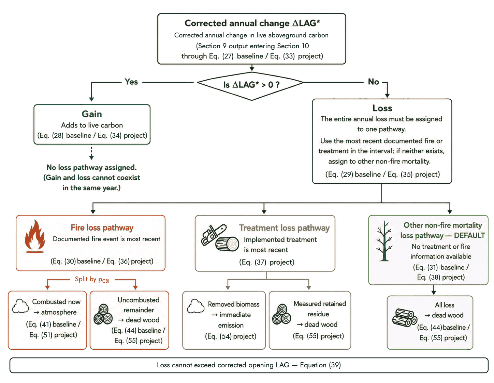

The initial corrected baseline state is the approved remote-sensing value at validation, after any approved product-level update. Equation (26) establishes it; Equation (27) carries the corrected baseline state forward by adding the corrected annual change to the opening state.

$$ LAG_{bsl,i,0}^{*} = LAG_{bsl,i,0}^{RS} \qquad \text{(26)} $$

$$ LAG_{bsl,i,t}^{*} = LAG_{bsl,i,t - 1}^{*} + \Delta LAG_{bsl,i,t}^{*} \qquad \text{(27)} $$

Where:

- `LAG*_bsl,i,0` — initial corrected baseline LAG state for pixel i (Mg C ha⁻¹)
- `LAG^RS_bsl,i,0` — raw remotely sensed baseline LAG density in pixel i at validation (Mg C ha⁻¹)
- `LAG*_bsl,i,t`, `LAG*_bsl,i,t−1` — corrected baseline LAG state for pixel i at the close of year t, and the corrected opening state (Mg C ha⁻¹)
- `ΔLAG*_bsl,i,t` — corrected signed annual baseline LAG change in pixel i during year t (Mg C ha⁻¹)
- `i` — pixel index; `t` — calendar-year accounting step

Corrected baseline gain and loss are mutually exclusive. Equation (28) identifies the nonnegative gain where the corrected annual change is positive; Equation (29) identifies the nonnegative loss where it is negative.

$$ G_{bsl,i,t}^{*} = \max\left( 0,\Delta LAG_{bsl,i,t}^{*} \right) \qquad \text{(28)} $$

$$ L_{bsl,i,t}^{*} = \max\left( 0, - \Delta LAG_{bsl,i,t}^{*} \right) \qquad \text{(29)} $$

The corrected baseline loss is assigned to exactly one pathway. Equation (30) assigns the full loss to the fire pathway where fire is the corrected annual loss class; Equation (31) assigns it to other non-fire mortality where that pathway applies.

$$ L_{fire,bsl,i,t}^{*} = \begin{cases} L_{bsl,i,t}^{*}, & d_{bsl,i,t}^{*} = \text{fire} \\ 0, & \text{otherwise} \end{cases} \qquad \text{(30)} $$

$$ L_{other,bsl,i,t}^{*} = \begin{cases} L_{bsl,i,t}^{*}, & d_{bsl,i,t}^{*} = \text{other} \\ 0, & \text{otherwise} \end{cases} \qquad \text{(31)} $$

Where `d*_bsl,i,t` is the corrected annual baseline loss-pathway class. Where no Section 9 correction changes the annual sign or magnitude, the corrected annual change and pathway equal the provisional values derived from Equation (4) and the disturbance record.

The project states follow the same construction. Equation (32) establishes the initial corrected project state; Equation (33) propagates it; Equations (34) and (35) split gain and loss; Equations (36) through (38) route the loss to fire, treatment, or other non-fire mortality by the corrected pathway class `d*_proj,i,t`.

$$ LAG_{proj,i,0}^{*} = LAG_{proj,i,0}^{RS} \qquad \text{(32)} $$

$$ LAG_{proj,i,t}^{*} = LAG_{proj,i,t - 1}^{*} + \Delta LAG_{proj,i,t}^{*} \qquad \text{(33)} $$

$$ G_{proj,i,t}^{*} = \max\left( 0,\Delta LAG_{proj,i,t}^{*} \right) \qquad \text{(34)} $$

$$ L_{proj,i,t}^{*} = \max\left( 0, - \Delta LAG_{proj,i,t}^{*} \right) \qquad \text{(35)} $$

$$ L_{fire,proj,i,t}^{*} = \begin{cases} L_{proj,i,t}^{*}, & d_{proj,i,t}^{*} = \text{fire} \\ 0, & \text{otherwise} \end{cases} \qquad \text{(36)} $$

$$ L_{trt,proj,i,t}^{*} = \begin{cases} L_{proj,i,t}^{*}, & d_{proj,i,t}^{*} = \text{trt} \\ 0, & \text{otherwise} \end{cases} \qquad \text{(37)} $$

$$ L_{other,proj,i,t}^{*} = \begin{cases} L_{proj,i,t}^{*}, & d_{proj,i,t}^{*} = \text{other} \\ 0, & \text{otherwise} \end{cases} \qquad \text{(38)} $$

Where the symbols mirror the baseline set for the project scenario: `LAG*_proj,i,t` the corrected project state, `ΔLAG*_proj,i,t` the corrected signed annual change, `G*` and `L*` the nonnegative gain and loss, and the three pathway quantities the exclusive fire, treatment, and other assignments (all Mg C ha⁻¹).

A project endpoint-response correction under Section 9.6 may reduce corrected gains to zero. Where independently supported residual loss remains after the eligible corrected gains in the field-anchor interval have been removed, Section 9.6 assigns the residual to eligible non-disturbance years exhibiting the strongest remotely sensed evidence of decline. The affected annual change becomes other non-fire mortality. The allocation and all subsequent corrected states satisfy the chronological capacity and endpoint-closure requirements in Section 9.

Starting from the preceding corrected field anchor, each year is calculated in order, so that every physical limit is based on the corrected opening LAG. For either scenario:

$$ 0 \leq L_{s,i,t}^{*} \leq LAG_{s,i,t - 1}^{*},\quad\quad s \in \{ bsl,proj\} \qquad \text{(39)} $$

Where:

- `L*_s,i,t` — corrected annual LAG loss for scenario s, pixel i, and year t (Mg C ha⁻¹)
- `LAG*_s,i,t−1` — corrected opening LAG state for scenario s, pixel i, and year t (Mg C ha⁻¹)
- `s` — scenario indicator; bsl for baseline or proj for project; `i` — pixel index; `t` — calendar-year accounting step

## 10.2 Baseline Pixel-Level Carbon Accounting

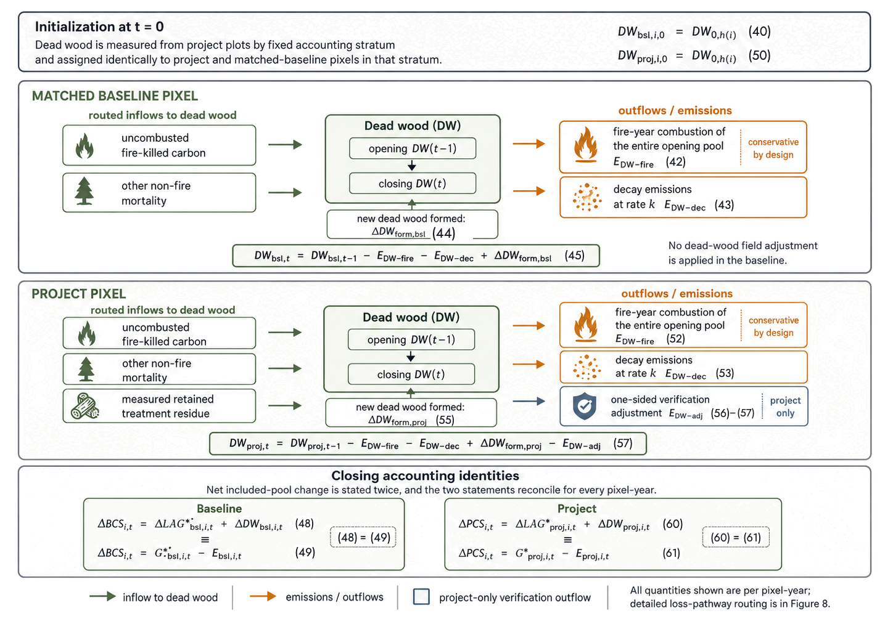

The baseline accounting engine is executed independently for every baseline pixel and calendar year. Initial dead wood is measured from project plots by fixed accounting stratum and applied identically to project and matched-baseline pixels in that stratum.

Equation (40) initializes baseline dead wood for each pixel from the plot-based dead-wood estimate for its fixed accounting stratum.

$$ DW_{bsl,i,0} = DW_{0,h(i)} \qquad \text{(40)} $$

Where:

- `DW_bsl,i,0` — initial baseline dead-wood density assigned to pixel i (Mg C ha⁻¹)
- `DW_0,h(i)` — initial dead-wood density measured for fixed stratum h(i) and assigned identically to project and baseline pixels in that stratum (Mg C ha⁻¹)
- `i` — pixel index; `h(i)` — fixed accounting stratum containing pixel i

Equation (41) calculates the portion of corrected baseline fire-attributable LAG loss that is emitted immediately through combustion.

$$ E_{LAG - fire,bsl,i,t} = p_{CBI,i,t}L_{fire,bsl,i,t}^{*} \qquad \text{(41)} $$

Where:

- `E_LAG-fire,bsl,i,t` — immediate baseline emission from combustion of fire-attributable live carbon in pixel i during year t (Mg C ha⁻¹)
- `p_CBI,i,t` — approved immediate-combustion fraction for fire-attributable live-carbon loss in pixel i and year t
- `L*_fire,bsl,i,t` — corrected baseline LAG loss assigned to the fire pathway in pixel i during year t (Mg C ha⁻¹)

Equation (42) calculates combustion of opening baseline dead wood in a fire-event pixel-year.

$$ E_{DW - fire,bsl,i,t} = I_{fire,i,t}DW_{bsl,i,t - 1} \qquad \text{(42)} $$

Where:

- `E_DW-fire,bsl,i,t` — baseline emission from combustion of opening dead wood in pixel i during year t (Mg C ha⁻¹)
- `I_fire,i,t` — fire-event occurrence indicator for pixel i and year t
- `DW_bsl,i,t−1` — opening baseline dead-wood density in pixel i for year t (Mg C ha⁻¹)

Equation (43) calculates decomposition emissions from the opening baseline dead wood that was not combusted during the year.

$$ E_{DW - dec,bsl,i,t} = \left( DW_{bsl,i,t - 1} - E_{DW - fire,bsl,i,t} \right)\left( 1 - e^{- k_{h(i)}} \right) \qquad \text{(43)} $$

Where:

- `E_DW-dec,bsl,i,t` — baseline dead-wood decomposition emission in pixel i during year t (Mg C ha⁻¹)
- `k_h(i)` — approved first-order dead-wood decomposition rate for fixed stratum h(i) (yr⁻¹)
- `e` — base of the natural logarithm

Equation (44) calculates new baseline dead wood formed from uncombusted fire mortality and other non-fire mortality.

$$ \Delta DW_{form,bsl,i,t} = L_{fire,bsl,i,t}^{*} - E_{LAG - fire,bsl,i,t} + L_{other,bsl,i,t}^{*} \qquad \text{(44)} $$

Equation (45) calculates closing baseline dead wood after combustion, decomposition, and new dead-wood formation; Equation (46) is the annual pool change.

$$ DW_{bsl,i,t} = DW_{bsl,i,t - 1} - E_{DW - fire,bsl,i,t} - E_{DW - dec,bsl,i,t} + \Delta DW_{form,bsl,i,t} \qquad \text{(45)} $$

$$ \Delta DW_{bsl,i,t} = DW_{bsl,i,t} - DW_{bsl,i,t - 1} \qquad \text{(46)} $$

Equation (47) sums the baseline emissions from live-carbon combustion, dead-wood combustion, and dead-wood decomposition.

$$ E_{bsl,i,t} = E_{LAG - fire,bsl,i,t} + E_{DW - fire,bsl,i,t} + E_{DW - dec,bsl,i,t} \qquad \text{(47)} $$

Equation (48) calculates the annual baseline change in included carbon pools as the combined change in LAG and dead wood; Equation (49) provides the accounting-closure check by expressing the same included-pool change as corrected gain minus emissions.

$$ \Delta BCS_{i,t} = \Delta LAG_{bsl,i,t}^{*} + \Delta DW_{bsl,i,t} \qquad \text{(48)} $$

$$ \Delta BCS_{i,t} = G_{bsl,i,t}^{*} - E_{bsl,i,t} \qquad \text{(49)} $$

Where:

- `ΔBCS_i,t` — net baseline change in included carbon pools for pixel i during year t; positive is a removal and negative is an emission (Mg C ha⁻¹)
- `G*_bsl,i,t` — nonnegative corrected annual baseline LAG gain in pixel i during year t (Mg C ha⁻¹)
- `E_bsl,i,t` — total accounted baseline carbon emission in pixel i during year t (Mg C ha⁻¹)

Equations (48) and (49) reconcile within the numerical tolerance specified in the monitoring report for every pixel-year.

## 10.3 Project Pixel-Level Carbon Accounting

The project accounting engine uses the same annual convention, corrected opening-state requirement, fire occurrence rule, decomposition parameter, and closure test as the baseline.

Equation (50) initializes project dead wood for each pixel from the same plot-based stratum estimate used for the baseline; Equations (51) through (53) mirror the baseline combustion and decomposition terms.

$$ DW_{proj,i,0} = DW_{0,h(i)} \qquad \text{(50)} $$

$$ E_{LAG - fire,proj,i,t} = p_{CBI,i,t}L_{fire,proj,i,t}^{*} \qquad \text{(51)} $$

$$ E_{DW - fire,proj,i,t} = I_{fire,i,t}DW_{proj,i,t - 1} \qquad \text{(52)} $$

$$ E_{DW - dec,proj,i,t} = \left( DW_{proj,i,t - 1} - E_{DW - fire,proj,i,t} \right)\left( 1 - e^{- k_{h(i)}} \right) \qquad \text{(53)} $$

Treatment loss is emitted immediately unless measured residue remains onsite. Equation (54) uses the full corrected treatment loss, including any correction from Section 9.2. Enter retained residue once under Equation (55), assign it to the same pixels as the treatment loss, and keep it within the bound in Equation (56).

$$ E_{trt,proj,i,t} = L_{trt,proj,i,t}^{*} - R_{trt,proj,i,t} \qquad \text{(54)} $$

Where:

- `E_trt,proj,i,t` — project treatment-attributable accounting emission in pixel i during year t (Mg C ha⁻¹)
- `L*_trt,proj,i,t` — corrected project LAG loss assigned to treatment in pixel i during year t (Mg C ha⁻¹)
- `R_trt,proj,i,t` — corrected treatment residue retained onsite and transferred to dead wood in pixel i during year t (Mg C ha⁻¹)

Equation (55) calculates new project dead wood formed from uncombusted fire mortality, other non-fire mortality, and retained treatment residue.

$$ \Delta DW_{form,proj,i,t} = L_{fire,proj,i,t}^{*} - E_{LAG - fire,proj,i,t} + L_{other,proj,i,t}^{*} + R_{trt,proj,i,t} \qquad \text{(55)} $$

Section 9 may supply a one-sided project dead-wood adjustment only in a verification year. It is zero in all other years and may not exceed the project dead wood available immediately before the adjustment:

$$ 0 \leq E_{DW - adj,proj,i,t} \leq DW_{proj,i,t - 1} - E_{DW - fire,proj,i,t} - E_{DW - dec,proj,i,t} + \Delta DW_{form,proj,i,t} \qquad \text{(56)} $$

Equation (57) calculates closing project dead wood after all annual inflows, emissions, and the verification dead-wood adjustment; Equation (58) is the annual pool change.

$$ DW_{proj,i,t} = DW_{proj,i,t - 1} - E_{DW - fire,proj,i,t} - E_{DW - dec,proj,i,t} + {\Delta DW}_{form,proj,i,t} - E_{DW - adj,proj,i,t} \qquad \text{(57)} $$

$$ \Delta DW_{proj,i,t} = DW_{proj,i,t} - DW_{proj,i,t - 1} \qquad \text{(58)} $$

Equation (59) sums all accounted project emissions and outflows for the pixel-year.

$$ E_{proj,i,t} = E_{LAG - fire,proj,i,t} + E_{DW - fire,proj,i,t} + E_{DW - dec,proj,i,t} + E_{trt,proj,i,t} + E_{DW - adj,proj,i,t} \qquad \text{(59)} $$

Equation (60) calculates the annual project change in included carbon pools; Equation (61) provides the accounting-closure check.

$$ \Delta PCS_{i,t} = \Delta LAG_{proj,i,t}^{*} + \Delta DW_{proj,i,t} \qquad \text{(60)} $$

$$ \Delta PCS_{i,t} = G_{proj,i,t}^{*} - E_{proj,i,t} \qquad \text{(61)} $$

Where:

- `ΔPCS_i,t` — net project change in included carbon pools for pixel i during year t; positive is a removal and negative is an emission (Mg C ha⁻¹)
- `G*_proj,i,t` — nonnegative corrected annual project LAG gain in pixel i during year t (Mg C ha⁻¹)
- `E_proj,i,t` — total accounted project carbon emission in pixel i during year t (Mg C ha⁻¹)

Equations (60) and (61) reconcile within the numerical tolerance specified in the monitoring report for every pixel-year. The dead-wood adjustment is an accounted outflow from the included pools; it is not an additional LAG loss and does not change the corrected annual LAG pathway.

***

# 11 Stratum Summaries, Period Benefit, and Joint Residual Uncertainty

## 11.1 Fixed-Stratum Summaries and Scenario-Period Stock Change

Carbon is tracked and physically accounted per pixel. Field or validation evidence may represent an entire fixed accounting stratum or a predefined subset within it. Any Section 9 correction is calculated over the support represented by that evidence and confined to the same support when it is allocated to pixels. Completed pixel results are pooled only after every contributing pixel-year has passed the applicable closure checks. Equation (62) then summarizes those completed results within the full fixed accounting stratum for reporting, sampling, quality control, and the period-benefit comparison in Sections 11.2 and 13.

Stratification is fixed for the life of the project. The boundaries and membership set at validation carry through every verification, and the control area is subdivided once to mirror the project. Fixing them is what keeps the comparison measured rather than chosen — strata that could be recut once outcomes were known would let a project select its own benchmark. A new project instance establishes its own stratum, with its own baseline matching, rather than joining an existing one whose baseline performance is already known. Instances combined into a grouped instance share its stratum start date.

$$ {\overline{X}}_{s,h,t} = \frac{1}{A_{s,h}}\sum_{i \in I_{s,h}}^{}a_{i}X_{s,i,t} \qquad \text{(62)} $$

Where:

- `X̄_s,h,t` — area-weighted fixed-stratum mean of annual pixel quantity X for scenario s, stratum h, and year t
- `X_s,i,t` — corrected or completed annual pixel quantity being summarized
- `A_s,h` — included support area for scenario s in fixed stratum h (ha)
- `I_s,h` — set of scenario-s pixels assigned to fixed stratum h
- `a_i` — area represented by pixel i (ha)
- `s` — scenario indicator; bsl for baseline or proj for project; `h` — fixed accounting stratum; `t` — calendar-year accounting step

Once every pixel-year in the period has passed its closure checks, the two scenarios are summed over the annual steps in verification period v. Equation (63) sums annual baseline stock change across the baseline pixels in each stratum, converts it to a per-hectare density over the baseline support area, and rescales it to the creditable project area for that stratum — the control area is deliberately larger than the project, so the baseline is expressed as a density before the two scenarios can be compared.

$$ \Delta{BCS}_{v} = \sum_{h \in H}^{}{A_{h}\sum_{t \in T_{v}}^{}{\overline{\Delta BCS}}_{bsl,h,t}} \qquad \text{(63)} $$

Where:

- `ΔBCS_v` — total baseline change in included carbon pools during verification period v, expressed over the creditable project area (Mg C)
- `A_h` — creditable project area assigned to fixed stratum h (ha)
- `ΔBCS̄_bsl,h,t` — area-weighted baseline stratum mean of net included-pool stock change in year t under Equation (62) (Mg C ha⁻¹)
- `H` — set of fixed accounting strata; `T_v` — set of annual accounting steps included in verification period v

Equation (64) applies the same stratum-mean-and-area construction to the project scenario, so both scenarios reach the period total by an identical route. The project support area equals the creditable project area for the stratum, which is what makes the two directly comparable.

$$ \Delta{PCS}_{v} = \sum_{h \in H}^{}{A_{proj,h}\sum_{t \in T_{v}}^{}{\overline{\Delta PCS}}_{proj,h,t}} \qquad \text{(64)} $$

Where:

- `ΔPCS_v` — total project change in included carbon pools during verification period v (Mg C)
- `A_proj,h` — included project support area in fixed stratum h; equal to the creditable project area for that stratum (ha)
- `ΔPCS̄_proj,h,t` — area-weighted project stratum mean of net included-pool stock change in year t under Equation (62) (Mg C ha⁻¹)
- `H` — set of fixed accounting strata; `T_v` — set of annual accounting steps included in verification period v

## 11.2 Period Benefit and the Joint Residual Uncertainty Deduction

Before calculating Equation (65), complete all Section 9 checks, the project dead-wood comparison, and the pixel-level closure tests in Section 10. The corrected annual values and the resulting carbon accounting are complete and reproducible. Resolve any inconsistency before calculating gross benefit.

Equation (65) is the first point in the accounting where the two scenarios meet. Everything upstream is computed separately for project and baseline; here the completed period statements are differenced to give the gross physical benefit — the divergence between the project's carbon record and the benchmark's over verification period v. Leakage enters as a term and is carried at zero, for the reasons given in Section 12. The benefit is gross because two conservatism steps still follow: the joint residual uncertainty deduction in Equation (66), and the carbon-debt ledger in Equations (69) and (70).

$$ \Delta C_{v} = \Delta PCS_{v} - \Delta BCS_{v} - LE_{v} \qquad \text{(65)} $$

Where:

- `ΔC_v` — gross project-versus-baseline physical benefit during verification period v before residual uncertainty and carbon debt (Mg C)
- `ΔPCS_v` — total project change in included carbon pools during verification period v (Mg C)
- `ΔBCS_v` — total baseline change in included carbon pools during verification period v, expressed over the creditable project area (Mg C)
- `LE_v` — leakage emissions in verification period v; equal to zero (Mg C)

Equation (66) subtracts a single project-level deduction, applied once after all corrected-value corrections are final. Section 11.3 derives `U_joint,v` by calculating the accounting chain under Monte Carlo sampling and taking the 10th percentile of the resulting benefit distribution. It is one deduction rather than several because the upstream fire-mortality bounds are already conservative; their sampling uncertainty is not charged again here.

$$ \Delta C_{v}^{cons} = \Delta C_{v} - U_{joint,v} \qquad \text{(66)} $$

Where:

- `ΔC^cons_v` — conservative verification-period benefit after the joint residual uncertainty deduction (Mg C)
- `ΔC_v` — gross project-versus-baseline physical benefit during verification period v (Mg C)
- `U_joint,v` — single project-level joint residual uncertainty deduction for verification period v (Mg C)

## 11.3 Deriving the Joint Residual Uncertainty

The joint residual uncertainty procedure includes material uncertainty that remains after point corrections and conservative physical bounds. It never includes the same discrepancy twice. Common-mode LAG-product error demonstrated to affect project and matched-baseline observations equivalently need not be deducted separately; only residual uncertainty in the project-minus-baseline LAG-change contrast that remains after corrected-value corrections is included in the joint procedure.

At minimum, the simulation represents material residual uncertainty in:

- field-anchor plot means and change estimates;
- project endpoint-response correction;
- baseline saturation correction;
- CBI-mortality transferability or model form not already embedded in `m^min_h,c` and `m^max_h,c`;
- project dead-wood response and its allocation;
- initial dead wood by fixed accounting stratum;
- dead-wood decomposition rate;
- treatment residue where a nonzero value is used; and
- any approved local remote-sensing update.

For Monte Carlo draw k, apply the sampled inputs through Sections 9 and 10 and calculate project benefit `ΔC_v^(k)`. The one-sided 90% lower bound is the 10th percentile of the simulated benefit distribution:

$$ LB_{0.90,v} = Q_{0.10}\left( \Delta C_{v}^{(k)} \right) \qquad \text{(67)} $$

Where:

- `LB_0.90,v` — one-sided 90% lower bound on the simulated project benefit for verification period v (Mg C)
- `Q_0.10` — 10th percentile operator applied to the simulated benefit distribution
- `ΔC_v^(k)` — simulated project-versus-baseline benefit in Monte Carlo realization k after corrected-value corrections (Mg C)
- `k` — Monte Carlo realization index; `v` — verification period

$$ U_{joint,v} = \max\left( 0,\Delta C_{v} - LB_{0.90,v} \right) \qquad \text{(68)} $$

Where:

- `U_joint,v` — single project-level joint residual uncertainty deduction for verification period v (Mg C)
- `ΔC_v` — gross project-versus-baseline physical benefit during verification period v (Mg C)
- `LB_0.90,v` — one-sided 90% lower bound on the simulated project benefit for verification period v (Mg C)

The joint deduction is applied once, under Equation (66). A simulation result cannot increase credited benefit above the corrected point estimate.

***

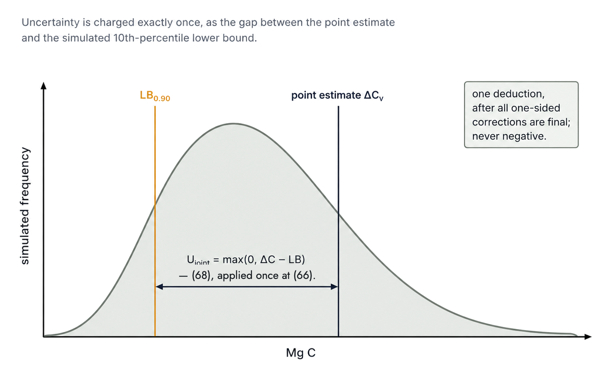

***

# 12 Leakage

Leakage is conservatively determined to be zero because eligible project activities increase regional biomass supply while not displacing timber harvest, land use, or another productive activity beyond the project boundary. Where fuel reduction is mechanical, it removes biomass that would otherwise remain at elevated wildfire risk, adding to rather than subtracting from regional wood and biomass supply; where it is prescribed fire, fuels are consumed in place and no marketable supply is created or displaced. No harvest or land use is displaced beyond the project boundary, and treatment does not create a supply shortfall.

Every identified spillover from eligible activities runs in the opposite direction — outward benefit rather than displaced harm. Fuel treatments modify fire behavior beyond their own footprint: spread rate, intensity, and spotting fall in the treatment shadow, and treated blocks give suppression the anchor points and access that make containment effective (Finney 2001; Ager et al. 2017). That shadow protects adjacent carbon stocks the project neither treats nor claims — leakage in reverse — positive leakage. Treatment activity likewise builds the capacity for more treatment: a trained workforce and contractor pool, processing and biomass-utilization infrastructure that turns removed material into supply rather than pile smoke, and the per-acre cost reductions that come with scale. Where classical leakage logic holds that an activity displaces its counterpart elsewhere, this activity lowers the barrier to the next project. Demonstration to neighboring landowners and the market effect of added — not subtracted — biomass supply run the same way. None of these benefits are credited.

Leakage enters the accounting as the term `LE_v` in Equation (65), carried at zero for every verification period. Because the uncounted spillovers are benefits, setting `LE_v` to zero understates, never overstates, net benefit — the same one-sided posture as the corrections in Sections 9 through 11.

***

# 13 Ledger, Issuance, Allocation, and Vintage

## 13.1 Project-Level Cumulative Ledger and Issuance

Issuance is decided once per verification period, at the project scale. The conservative benefit from Equation (66) is applied against any carbon debt carried forward, then floored at zero — a period ending in deficit issues nothing and carries the deficit into the next period.

Equation (69) nets the current conservative benefit against debt carried from the prior verification to give the ledger balance `S_v`.

$$ S_{v} = \Delta C_{v}^{cons} - B_{v - 1} \qquad \text{(69)} $$

Where:

- `S_v` — project ledger balance before the issuance floor at the close of verification period v (Mg C)
- `ΔC^cons_v` — conservative verification-period benefit after the joint residual uncertainty deduction (Mg C)
- `B_v−1` — nonnegative carbon debt carried into verification period v from the preceding verification period (Mg C)

Equation (70) converts a negative ledger balance into the carbon debt carried into the next verification period. Debt starts at zero at project initiation, and any period whose balance is positive clears it.

$$ B_{v} = \max\left( 0, - S_{v} \right),\quad\quad B_{0} = 0 \qquad \text{(70)} $$

Where:

- `B_v` — closing nonnegative carbon-debt balance carried to the next verification period (Mg C)
- `S_v` — project ledger balance before the issuance floor at the close of verification period v (Mg C)
- `B_0` — initial carbon-debt balance; equal to zero (Mg C)

Equation (71) issues the positive part of the ledger balance as the period's eligible reductions and removals.

$$ ERR_{v}^{C} = \max\left( 0,S_{v} \right) \qquad \text{(71)} $$

Where:

- `ERR^C_v` — net reductions and removals eligible for issuance at the close of verification period v, in carbon units (Mg C)
- `S_v` — project ledger balance before the issuance floor at the close of verification period v (Mg C)

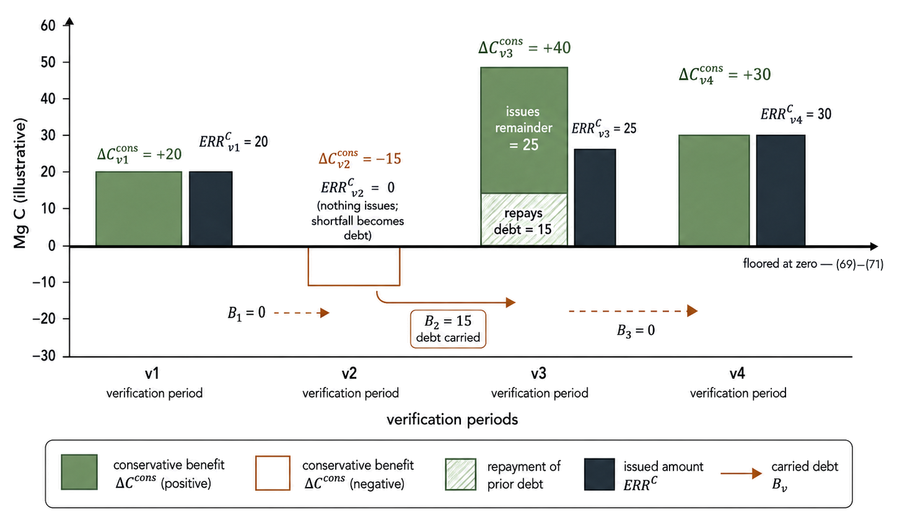

The first verification field anchor is the earliest point at which credits may issue. At each verification, the code calculates the unique creditable project area affected by one or more unresolved moderate- or high-severity fire events that have not yet reached their endpoint. Each project pixel is counted once, including where fire perimeters overlap, and the denominator is the total creditable project area. Where the affected area exceeds 10%, no credits may issue until the applicable events close and the project-fire mortality-floor procedure is complete. An affected area equal to or less than 10% does not trigger the hold before the endpoint. Low-severity fire does not count because its project-fire lower bound is zero. Baseline fires do not trigger the gate and remain fully represented in the fixed dynamic baseline. Any project-fire event that has reached its endpoint completes Equations (12) through (14) before a verification period containing its final eligible post-fire annual step may issue, regardless of affected area.

Where unresolved moderate- or high-severity project-fire area exceeds 10%, the verification may close the current field anchor, but Equations (69) through (87) are not finalized. At the first later verification that satisfies the gate, calculate Equations (63) through (87) using `T_v` and `Y_v` that include all unissued annual accounting steps since the preceding successful issuance. Positive and negative annual results are retained, and provisional outputs from a blocked verification are not issued or added a second time.

Where issuance proceeds before the endpoint while unresolved moderate- or high-severity project-fire area is 10% or less, observed annual project mortality remains in the current accounting. At event closure, the full Equation (12) final-step adjustment, including any provisional recovery since the response-window minimum, is assigned to the final eligible post-fire annual step and therefore enters the verification period containing that step. That verification period cannot issue until the event closes and Equation (14) is satisfied. The adjustment is carried through project LAG, dead wood, and the project dead-wood response; any resulting reduction in included-pool benefit reduces current issuance or creates carbon debt through Equations (69) and (70). No prior issuance calculation or vintage assignment is reopened.

## 13.2 Allocation Between Removals and Emission Reductions

Issuance is split between removals and emission reductions because the two carry different program treatment, not because they are physically separable at the pixel. The split is made at the stratum scale: strata gaining more than the baseline contribute to removals, strata losing less than the baseline contribute to avoided emissions. The issued total from Equation (71) is divided between the two pools in proportion to their positive magnitudes.

Equations (72) and (73) restate the same period totals used in Equations (63) and (64), but per stratum and per hectare, so the two scenarios can be compared stratum by stratum.

$$ \Delta P_{h,v} = \sum_{t \in T_{v}}^{}{\overline{\Delta PCS}}_{proj,h,t} \qquad \text{(72)} $$

Where:

- `ΔP_h,v` — period-summed project included-pool stock change density in stratum h during verification period v (Mg C ha⁻¹)
- `ΔPCS̄_proj,h,t` — area-weighted project stratum mean of net included-pool stock change in year t under Equation (62) (Mg C ha⁻¹)
- `T_v` — set of annual accounting steps included in verification period v

$$ \Delta B_{h,v} = \sum_{t \in T_{v}}^{}{\overline{\Delta BCS}}_{bsl,h,t} \qquad \text{(73)} $$

Where:

- `ΔB_h,v` — period-summed baseline included-pool stock change density in stratum h during verification period v (Mg C ha⁻¹)
- `ΔBCS̄_bsl,h,t` — area-weighted baseline stratum mean of net included-pool stock change in year t under Equation (62) (Mg C ha⁻¹)
- `T_v` — set of annual accounting steps included in verification period v

Equation (74) assigns the full project-minus-baseline difference to removals where the project stock change is positive.

$$ CR_{v}^{raw} = \sum_{h \in H}^{}A_{h}\left( \Delta P_{h,v} - \Delta B_{h,v} \right)\mathbf{1}\left\{ \Delta P_{h,v} > 0 \right\} \qquad \text{(74)} $$

Where:

- `CR^raw_v` — raw removal-side project-versus-baseline benefit for verification period v before flooring (Mg C)
- `A_h` — creditable project area assigned to fixed stratum h (ha)
- `ΔP_h,v` — period-summed project included-pool stock change density in stratum h during verification period v (Mg C ha⁻¹)
- `ΔB_h,v` — period-summed baseline included-pool stock change density in stratum h during verification period v (Mg C ha⁻¹)
- `H` — set of fixed accounting strata

Equation (75) assigns the full project-minus-baseline difference to emission reductions where the project stock change is zero or negative.

$$ ER_{v}^{raw} = \sum_{h \in H}^{}A_{h}\left( \Delta P_{h,v} - \Delta B_{h,v} \right)\mathbf{1}\left\{ \Delta P_{h,v} \leq 0 \right\} \qquad \text{(75)} $$

Where:

- `ER^raw_v` — raw emission-reduction-side project-versus-baseline benefit for verification period v before flooring (Mg C)
- `A_h` — creditable project area assigned to fixed stratum h (ha)
- `ΔP_h,v` — period-summed project included-pool stock change density in stratum h during verification period v (Mg C ha⁻¹)
- `ΔB_h,v` — period-summed baseline included-pool stock change density in stratum h during verification period v (Mg C ha⁻¹)
- `H` — set of fixed accounting strata

Equations (76) and (77) floor each raw result at zero. Equations (74) and (75) sum signed differences across strata, so a category's total can come out negative — that means the category contributed nothing on net and takes no share of the issued amount.

$$ CR_{v}^{pos} = \max\left( 0,CR_{v}^{raw} \right) \qquad \text{(76)} $$

Where:

- `CR^pos_v` — nonnegative removals allocation pool for verification period v (Mg C)
- `CR^raw_v` — raw removal-side project-versus-baseline benefit for verification period v before flooring (Mg C)

$$ ER_{v}^{pos} = \max\left( 0,ER_{v}^{raw} \right) \qquad \text{(77)} $$

Where:

- `ER^pos_v` — nonnegative emission-reductions allocation pool for verification period v (Mg C)
- `ER^raw_v` — raw emission-reduction-side project-versus-baseline benefit for verification period v before flooring (Mg C)

Where the two positive pools sum to more than zero, Equation (78) assigns removals their proportional share of the issued total.

$$ CR_{v}^{C} = ERR_{v}^{C}\frac{CR_{v}^{pos}}{CR_{v}^{pos} + ER_{v}^{pos}} \qquad \text{(78)} $$

Where:

- `CR^C_v` — issued removals allocated to verification period v in carbon units (Mg C)
- `ERR^C_v` — net reductions and removals eligible for issuance at the close of verification period v, in carbon units (Mg C)
- `CR^pos_v` — nonnegative removals allocation pool for verification period v (Mg C)
- `ER^pos_v` — nonnegative emission-reductions allocation pool for verification period v (Mg C)

Equation (79) assigns the remainder to emission reductions, so the two categories sum exactly to the issued total.

$$ ER_{v}^{C} = ERR_{v}^{C} - CR_{v}^{C} \qquad \text{(79)} $$

Where:

- `ER^C_v` — issued emission reductions allocated to verification period v in carbon units (Mg C)
- `ERR^C_v` — net reductions and removals eligible for issuance at the close of verification period v, in carbon units (Mg C)
- `CR^C_v` — issued removals allocated to verification period v in carbon units (Mg C)

## 13.3 Vintage-Year Assignment and Conversion to CO₂e

Section 13.2 divided the issued total between removals and reductions for the whole verification period. This subsection assigns each of those two amounts to the calendar years within the period and converts carbon to CO₂e. The positive category pools in Equations (76) and (77) are calculated separately for each calendar year y within verification period v.

Equation (80) restates the project benefit of Equation (65) for a single calendar year rather than the whole verification period, using the stratum densities of Equations (72) and (73) evaluated over that year alone. The annual benefits sum to the period benefit, so this is a decomposition of Equation (65) rather than a new quantity.

$$ \Delta C_{y} = \sum_{h}^{}A_{h}\left( \Delta P_{h,y} - \Delta B_{h,y} \right) \qquad \text{(80)} $$

Where:

- `ΔC_y` — net project benefit in calendar year y (Mg C)
- `A_h` — creditable project area assigned to fixed stratum h (ha)
- `ΔP_h,y` — project stock-change density for stratum h in year y, per Equation (72) evaluated over year y alone (Mg C ha⁻¹)
- `ΔB_h,y` — matched-baseline stock-change density for stratum h in year y, per Equation (73) evaluated over year y alone (Mg C ha⁻¹)
- `h` — fixed accounting stratum; `y` — calendar year

Equations (81) and (82) set the weight by which each category's issued total is spread across the years in the period. Equation (81) applies where that category's own yearly pools sum to more than zero.

$$ w_{c,y,v} = \frac{c_{y}^{pos}}{\sum_{y' \in Y_{v}}^{}c_{y'}^{pos}}, \sum_{y' \in Y_{v}}^{}c_{y'}^{pos} > 0 \qquad \text{(81)} $$

Where:

- `w_c,y,v` — allocation weight for category c in calendar year y within verification period v (dimensionless)
- `c` — category indicator; CR for removals or ER for emission reductions
- `c^pos_y` — positive allocation pool for category c calculated for calendar year y (Mg C)
- `Y_v` — set of calendar years included in verification period v
- `y'` — summation index over calendar years in the verification period

Equation (82) applies where those pools sum to zero, which Equations (76) and (77) permit because a period total is not the sum of the yearly totals. The weight then follows the year in which the benefit actually accrued. That denominator is never zero: a period with an amount to issue has a positive net benefit, and the annual benefits sum to it, so at least one year must be positive.

$$ w_{c,y,v} = \frac{\max\left( 0,\Delta C_{y} \right)}{\sum_{y' \in Y_{v}}^{}{\max\left( 0,\Delta C_{y'} \right)}}, \sum_{y' \in Y_{v}}^{}c_{y'}^{pos} = 0 \qquad \text{(82)} $$

Where:

- `w_c,y,v` — allocation weight for category c in calendar year y within verification period v (dimensionless)
- `c` — category indicator; CR for removals or ER for emission reductions
- `ΔC_y` — net project benefit in calendar year y, per Equation (80) (Mg C)
- `c^pos_y` — positive allocation pool for category c calculated for calendar year y (Mg C)
- `Y_v` — set of calendar years included in verification period v
- `y'` — summation index over calendar years in the verification period

Equation (83) applies the removals weight to the removals issued for the verification period, giving each year its share. The weights sum to one across the period, so the yearly allocations sum exactly to the period total.

$$ CR_{v,y}^{C} = CR_{v}^{C}w_{CR,y,v} \qquad \text{(83)} $$

Where:

- `CR^C_v,y` — issued removal benefit from verification period v assigned to vintage year y in carbon units (Mg C)
- `CR^C_v` — issued removals allocated to verification period v in carbon units (Mg C)
- `w_CR,y,v` — allocation weight for removals in calendar year y within verification period v, per Equations (81) and (82) (dimensionless)

Equation (84) does the same for issued emission reductions, using the emission-reductions weight.

$$ ER_{v,y}^{C} = ER_{v}^{C}w_{ER,y,v} \qquad \text{(84)} $$

Where:

- `ER^C_v,y` — issued emission-reduction benefit from verification period v assigned to vintage year y in carbon units (Mg C)
- `ER^C_v` — issued emission reductions allocated to verification period v in carbon units (Mg C)
- `w_ER,y,v` — allocation weight for emission reductions in calendar year y within verification period v, per Equations (81) and (82) (dimensionless)

Equations (85) and (86) convert each category's yearly allocation from carbon to CO₂e using the 44/12 molecular-mass ratio, summing across any verification period that allocated credits to that year.

$$ CR_{y} = \sum_{v}^{}CR_{v,y}^{C}\frac{44}{12} \qquad \text{(85)} $$

Where:

- `CR_y` — carbon dioxide removals assigned to vintage year y (t CO₂e)
- `CR^C_v,y` — issued removal benefit from verification period v assigned to vintage year y in carbon units (Mg C)
- `44/12` — ratio of the molecular mass of carbon dioxide to carbon
- `y` — calendar year; also the vintage year to which credits allocated to that year are issued
- `v` — verification period

$$ ER_{y} = \sum_{v}^{}ER_{v,y}^{C}\frac{44}{12} \qquad \text{(86)} $$

Where:

- `ER_y` — GHG emission reductions assigned to vintage year y (t CO₂e)
- `ER^C_v,y` — issued emission-reduction benefit from verification period v assigned to vintage year y in carbon units (Mg C)
- `44/12` — ratio of the molecular mass of carbon dioxide to carbon
- `y` — calendar year; also the vintage year to which credits allocated to that year are issued
- `v` — verification period

Equation (87) calculates total reductions and removals eligible for issuance in each vintage year.

$$ ERR_{y} = CR_{y} + ER_{y} \qquad \text{(87)} $$

Where:

- `ERR_y` — total net GHG emission reductions and removals eligible for issuance in vintage year y (t CO₂e)
- `CR_y` — carbon dioxide removals assigned to vintage year y (t CO₂e)
- `ER_y` — GHG emission reductions assigned to vintage year y (t CO₂e)

In crediting applications, credit issuance and any buffer-pool contribution follow the applicable program's rules and non-permanence risk requirements.

***

# 14 Monitoring

This section specifies the data and parameters the approach requires (Sections 14.1 and 14.2) and the monitoring plan that governs how they are obtained, processed, quality-controlled, and reported (Sections 14.3 through 14.10).

## 14.1 Data and Parameters Available at Validation

| Data/Parameter | Fixed control area (matched control mask) |
|---|---|
| Data unit | pixels (m) / ha |
| Description | Set of untreated pixels matched to the project at t=0, forming the DPB |
| Equations | Eq 62, 63, 73 |
| Source of data | Approved RS LAG product + covariate matching (Section 6) |
| Value applied | Established at t=0 |
| Justification of choice of data or description of measurement methods and procedures applied | Selected via covariate matching; held fixed for the crediting period |
| Purpose of data | Basis of the dynamic performance benchmark |
| Comments | Reselection only via new validation. |

| Data/Parameter | Matching covariates |
|---|---|
| Data unit | mixed (Mg C ha⁻¹; categorical; %; degrees) |
| Description | LAG density, existing vegetation cover/type, ecoregion, wildfire hazard, slope/topography, operational accessibility, hydrologic proximity where relevant |
| Equations | Section 6, Equations (1)–(3) |
| Source of data | RS + geospatial datasets |
| Value applied | Per project |
| Justification of choice of data or description of measurement methods and procedures applied | Continuous covariates: mean SMD < 0.05, none > 0.10 (Section 6.6) |
| Purpose of data | Ensure project/control comparability |
| Comments | — |

| Data/Parameter | `p_CBI` (severity-class combusted fraction) |
|---|---|
| Data unit | dimensionless |
| Description | Fraction of live aboveground carbon emitted immediately by fire, by CBI class |
| Equations | Eq 41, 51 |
| Source of data | Default from literature (Harmon et al. 2022; Stenzel et al. 2019) |
| Value applied | Low 0.03; Moderate 0.07; High 0.13; No fire 0 |
| Justification of choice of data or description of measurement methods and procedures applied | Conservative upper-bound of stand-level live-biomass combustion |
| Purpose of data | Split fire loss into immediate emission vs dead-wood transfer |
| Comments | The approved severity-class values and any project-specific alternative satisfy Section 5 and are applied consistently to project and baseline fire accounting. |

| Data/Parameter | CBI severity-class breakpoints |
|---|---|
| Data unit | CBI (0–3) |
| Description | Unburned < 0.1; low 0.1 ≤ CBI < 1.25; moderate 1.25 ≤ CBI < 2.25; high ≥ 2.25 |
| Equations | Eq 6, 41, 51 |
| Source of data | Miller & Thode 2007 |
| Value applied | As listed |
| Justification of choice of data or description of measurement methods and procedures applied | Standard CBI classification |
| Purpose of data | Assign severity class |
| Comments | — |

| Data/Parameter | `k_h(i)` (dead-wood decomposition rate assigned by fixed stratum) |
|---|---|
| Data unit | yr⁻¹ |
| Description | Approved first-order decay constant assigned to fixed stratum h(i) |
| Equations | Eq 43, 53 |
| Source of data | Forest-type lookup table (literature) and stratum assignment documented in the monitoring plan |
| Value applied | Conservative (slow) end of forest-type range for fixed stratum h(i) |
| Justification of choice of data or description of measurement methods and procedures applied | Governs dead-wood decomposition |
| Purpose of data | Dead-wood emissions over time |
| Comments | — |

| Data/Parameter | `DW_0,h(i)` (initial dead-wood pool at t=0) |
|---|---|
| Data unit | Mg C ha⁻¹ |
| Description | Initial dead-wood density measured for fixed stratum h(i) and assigned identically to project and baseline pixels in that stratum |
| Equations | Eq 40, 50 |
| Source of data | Project plot-based field inventory at t=0 |
| Value applied | Measured at t=0 |
| Justification of choice of data or description of measurement methods and procedures applied | Field measurement per the Section 14.8 field-measurement requirements |
| Purpose of data | Initial dead-wood pool |
| Comments | — |

| Data/Parameter | `A_h` and `A_proj,h` (project stratum areas) |
|---|---|
| Data unit | ha |
| Description | Creditable project area in fixed stratum h and included project support area in that stratum; A_proj,h = A_h |
| Equations | Eq 63, 64, 74, 75, 80 |
| Source of data | Project geospatial mask (GIS) |
| Value applied | Per fixed accounting stratum |
| Justification of choice of data or description of measurement methods and procedures applied | Qualifying pixels per Section 4 (≥ 60% of area) |
| Purpose of data | Scale stratum-density results to the corresponding creditable project area |
| Comments | — |

| Data/Parameter | Approved remote-sensing LAG product |
|---|---|
| Data unit | — |
| Description | Wall-to-wall LAG estimator (name, version, validation stage) |
| Equations | Eq 4, 5, 26, 32 |
| Source of data | Approved RS product |
| Value applied | Per project |
| Justification of choice of data or description of measurement methods and procedures applied | Must meet product-eligibility / CEOS validation criteria (Section 5) |
| Purpose of data | Source of LAG estimates |
| Comments | Same product and version for project and control. |

| Data/Parameter | `U_joint,v` |
|---|---|
| Data unit | Mg C |
| Description | Single project-level joint residual uncertainty deduction for the verification period |
| Equations | Eq 66 |
| Source of data | Section 11.3 (Monte Carlo simulation) |
| Value applied | One-sided 90% (10th percentile); magnitude derived per verification period |
| Justification of choice of data or description of measurement methods and procedures applied | Section 11.3 derives the deduction by Monte Carlo as the gap between the period benefit and its one-sided 90% lower bound, U_joint,v = max(0, ΔC_v − LB_0.90,v). |
| Purpose of data | Conservative uncertainty deductions |
| Comments | — |

## 14.2 Data and Parameters Monitored

| Data/Parameter | `LAG^RS_proj,i,t` |
|---|---|
| Data unit | Mg C ha⁻¹ |
| Description | Raw remotely sensed project LAG density for pixel i and calendar year t |
| Equations | Eq 5, 32 |
| Source of data | Approved RS product |
| Description of measurement methods and procedures to be applied | Same validated product and workflow for each period |
| Frequency of monitoring/recording | Annual observations may be compiled and processed in a batch at verification |
| QA/QC procedures to be applied | Mask checks; product-version consistency; missing-pixel checks |
| Purpose of data | Project annual LAG record |
| Calculation method | Measured (RS) |
| Comments | Distinct from corrected project LAG states and changes, which carry an asterisk. |

| Data/Parameter | `LAG^RS_bsl,i,t` |
|---|---|
| Data unit | Mg C ha⁻¹ |
| Description | Raw remotely sensed fixed-control LAG density for pixel i and calendar year t |
| Equations | Eq 4, 26 |
| Source of data | Approved RS product |
| Description of measurement methods and procedures to be applied | Same product as project |
| Frequency of monitoring/recording | Annual; observations may be compiled and processed in a batch at verification |
| QA/QC procedures to be applied | Same grid/alignment as project |
| Purpose of data | Baseline (DPB) annual LAG record |
| Calculation method | Measured (RS) |
| Comments | Distinct from corrected baseline LAG states and changes, which carry an asterisk. |

| Data/Parameter | Fire perimeter and date |
|---|---|
| Data unit | — / date |
| Description | Burned-area extent and timing affecting project and control |
| Equations | Eq 6, 30, 36 |
| Source of data | Fire perimeter product (e.g., MTBS/RAVG or regional equivalent) |
| Description of measurement methods and procedures to be applied | Compile perimeters, dates, severity products |
| Frequency of monitoring/recording | Per fire event |
| QA/QC procedures to be applied | Cross-check with severity evidence |
| Purpose of data | Identify fire-event pixels, open response events, and the project-fire area-gate area |
| Calculation method | Measured |
| Comments | — |

| Data/Parameter | CBI / severity class |
|---|---|
| Data unit | CBI (0–3) |
| Description | Fire severity in burned pixels |
| Equations | Eq 6, 41, 51 |
| Source of data | Field CBI and/or calibrated satellite severity |
| Description of measurement methods and procedures to be applied | Sampling design/timing per Section 14.8; class interpretation |
| Frequency of monitoring/recording | Per fire event |
| QA/QC procedures to be applied | Field vs satellite consistency |
| Purpose of data | Assign p_CBI, the applicable mortality bound, and severity eligibility for the project-fire area gate |
| Calculation method | Measured |
| Comments | — |

| Data/Parameter | Treatment records |
|---|---|
| Data unit | mixed |
| Description | Activity type, treated area, dates, biomass affected/removed and disposition, and the information used to set the minimum treatment loss |
| Equations | Eq 37, 54, 55; Equations (7)–(9) |
| Source of data | Project records |
| Description of measurement methods and procedures to be applied | Linked to geospatial treatment mask |
| Frequency of monitoring/recording | Per treatment |
| QA/QC procedures to be applied | Record completeness; double-counting checks; correct assignment of the minimum treatment loss to treated pixels; checks against the fire record |
| Purpose of data | Project emissions |
| Calculation method | Measured |
| Comments | — |

| Data/Parameter | `L*^trt_proj,i,t` |
|---|---|
| Data unit | Mg C ha⁻¹ |
| Description | Corrected treatment-attributable LAG loss for pixel i in year t, including any Section 9.2 shortfall assigned to the treatment-affected annual step |
| Equations | Eq 37, 54; Equations (7)–(9) |
| Source of data | Treatment records + RS |
| Description of measurement methods and procedures to be applied | Calculated under Section 9.2 and Equation (37); the emission it drives is Equation (54) |
| Frequency of monitoring/recording | Per treatment |
| QA/QC procedures to be applied | Consistency with the treatment records, treatment-response window, minimum treatment loss, and Equation (39) |
| Purpose of data | Immediate treatment emission |
| Calculation method | Calculated |
| Comments | — |

| Data/Parameter | `L^min,trt_proj,i,e` |
|---|---|
| Data unit | Mg C ha⁻¹ |
| Description | Conservative minimum LAG loss assigned to project pixel i for treatment event e |
| Equations | Equations (8)–(9) |
| Source of data | Approved treatment records and pretreatment LAG |
| Description of measurement methods and procedures to be applied | Set before post-treatment remote-sensing results are reviewed. Pixels in the same treatment unit may share a value, but the value is assigned and tested pixel by pixel and may not exceed corrected opening LAG. |
| Frequency of monitoring/recording | Per treatment |
| QA/QC procedures to be applied | Treatment-unit mapping; consistency with documented activity, intensity, biomass affected or removed, and pretreatment LAG |
| Purpose of data | Minimum treatment loss used in the pixel-level response test |
| Calculation method | Measured or conservatively set from approved treatment records |
| Comments | Set to zero for treatments not expected to remove live woody biomass. Prescribed fire, cultural fire, and managed wildfire follow Section 9.4. |

| Data/Parameter | Field-plot measurements |
|---|---|
| Data unit | mixed (cm, m, Mg C ha⁻¹) |
| Description | Species, DBH, height, live/dead status, mortality, decay class, plot geometry, treatment/fire status |
| Equations | Eq 40, 50; Equations (16), (19), (23) |
| Source of data | Field plots |
| Description of measurement methods and procedures to be applied | Fixed-area, sub-meter GNSS plots; allometrics; dead-wood protocol |
| Frequency of monitoring/recording | At validation and each verification or issuance field anchor; additional event-specific measurement only where required to support an approved local update or endpoint |
| QA/QC procedures to be applied | Calibration vs validation separation |
| Purpose of data | Anchor corrected annual LAG records; initialize and reconcile dead wood; support Section 9 tests |
| Calculation method | Measured |
| Comments | Detailed in Section 14.8. |

| Data/Parameter | Optional project-fire endpoint evidence |
|---|---|
| Data unit | Mg C ha⁻¹ |
| Description | Field or approved regional evidence used where needed to support an event-specific project-fire endpoint or local CBI-to-mortality relationship |
| Equations | Section 9, Equations (10)–(14) |
| Source of data | Field plots and/or approved regional or forest-type evidence |
| Description of measurement methods and procedures to be applied | No dedicated post-fire visit is required by default. Use event-specific evidence only where the default endpoint cannot be applied or a local relationship is proposed. |
| Frequency of monitoring/recording | As needed; not automatically disturbance-triggered |
| QA/QC procedures to be applied | Representativeness, temporal alignment, CBI calibration, and consistency with the three-year response window |
| Purpose of data | Support the project-fire mortality floor or an approved event-specific endpoint |
| Calculation method | Measured or derived from approved evidence |
| Comments | Methodology-default Table 9-1 values may be used without dedicated post-fire plots. |

| Data/Parameter | Dead-wood pool (`DW_s,i,t`) |
|---|---|
| Data unit | Mg C ha⁻¹ |
| Description | Scenario-specific dead-wood stock propagated annually for project and baseline pixels |
| Equations | Eq 40–49, 50–61 |
| Source of data | Calculated + plot remeasurement |
| Description of measurement methods and procedures to be applied | Baseline dead wood is propagated under Equation (45); project dead wood is propagated under Equation (57) and reconciled under Section 9.7, Equations (23)–(25) |
| Frequency of monitoring/recording | Calculated annually; field remeasurement at validation and each verification field anchor |
| QA/QC procedures to be applied | Consistency with plot data |
| Purpose of data | Dead-wood accounting |
| Calculation method | Calculated |
| Comments | — |

## 14.3 The Monitoring Plan

Applying the approach to a landscape requires a monitoring plan: a record of how the data and parameters in Sections 14.1 and 14.2 are obtained, recorded, compiled, analyzed, quality controlled, archived, and reported, detailed enough for an independent analyst to reproduce the project-versus-baseline calculations, uncertainty deductions, and issuance quantities for each verification period.

The monitoring plan identifies responsibilities for annual remote-sensing processing, treatment and fire records, field inventory, corrected-value reconciliation, dead-wood accounting, uncertainty analysis, geospatial data management, QA/QC, and verification reporting.

The required frequencies are:

- annual: remote-sensing LAG observations, annual changes, disturbance records, corrected-state propagation, dead-wood propagation, and vintage calculations;
- per event: treatment records, fire perimeters, dates, and severity evidence; and
- at validation and each verification/issuance: field inventory; the Section 9 treatment, fire, saturation, project endpoint-response, and dead-wood checks; the Section 11 joint uncertainty calculation; and completion of Sections 10 through 13.

Verification may occur at sub-decadal or decadal intervals. Credits cannot issue until Section 9 has closed the current field-anchor interval and the project-fire area gate has been evaluated. If the gate blocks issuance, the field anchor may still close, but Equations (69) through (87) remain open. The next successful issuance calculation uses Equations (63) through (87) for all unissued annual steps since the previous successful issuance.

## 14.4 Annual Accounting and the Verification Cycle

Annual accounting begins at project initiation. Keep one annual step for project and baseline LAG, treatment emissions, retained residue, fire effects, and dead-wood states, but calculate the full interval in one batch at verification. Credits cannot issue before the end of the monitoring period and are subject to the Section 13.1 project-fire area gate.

The annual steps are needed to assign losses to fire, treatment, or other mortality and to carry LAG, dead wood, fire occurrence, and vintages forward correctly, even when verification occurs less often.

At verification, first use Section 9 to set the corrected annual changes and loss pathways for the full interval since the preceding field anchor. Then calculate Section 10 once, in year order. Keep all corrections accepted at earlier field anchors. If an earlier verification failed the project-fire area gate, the next successful issuance calculation includes every unissued annual step since the previous successful issuance; do not issue or separately carry forward the blocked outputs.

At the end of the monitoring period:

- apply the treatment-step, fire, and saturation procedures;
- complete the project endpoint-response reconciliation from the preceding field anchor through the verification date;
- set the corrected annual project and baseline LAG changes and loss pathways, then complete Section 10 in year order;
- apply the project dead-wood response at the verification date;
- confirm annual state recurrence, endpoint closure, dead-wood recurrence, and Section 10 accounting closure;
- calculate the joint residual uncertainty deduction; and
- permit the validated cumulative benefit from project initiation through the verification date to enter the Section 13 issuance ledger, subject to the project-fire area gate.

The same procedure applies to each subsequent field measurement. Corrections in a later interval do not reset corrected states established at earlier field anchors. Pre-endpoint issuance under the project-fire area gate follows Section 13.1; event-closure adjustments follow Section 9.4; any resulting carbon debt is handled under Section 13.1.

Issuance requires all of the following:

- the annual observations and field anchors for the interval are present;
- the represented field-inference domain is supported;
- the corrected annual record satisfies Equation (22);
- the dead-wood adjustment satisfies Equation (25);
- the Section 10 state and mass-balance identities close;
- every project-fire event that has reached its endpoint is closed and Equations (12) through (14) are satisfied;
- the union of pre-endpoint unresolved moderate- and high-severity project-fire area does not exceed 10% of the total creditable project area (the Section 13.1 gate);
- every required input and evidence source is available, or an approved conservative default is applied; and
- the project can reproduce the corrected-value and physical-accounting chain.

Open baseline-fire events and low-severity project-fire events do not prevent issuance. Where the area gate fails, the field anchor may close but the Section 13 issuance calculation remains open and all unissued annual steps carry into the next calculation. Where any other requirement fails, resolve it before the Section 13 result is finalized.

## 14.5 Same-Step Treatment and Fire

The monitoring plan retains the dates and footprints of both events. Where annual data cannot separate their LAG effects, the corrected annual loss is assigned to the most recent documented disturbance. No sub-annual plot visit, image interpolation, or reconstructed gross-flow partition is required. The decision rule is applied consistently and documented before the crediting outcome is calculated.

## 14.6 Geospatial Data Management

All project, control, stratum, treatment, fire, saturation-evidence, and field-inference-domain datasets are maintained as reproducible geospatial records. For saturation, archive the pretreatment pixel-level saturation indicator, the approved product- or region-specific classification criterion, the pixels identified as saturation-prone within each stratum and their included area, the evidence domain used in Equation (16), and a check showing that pixels outside that set received no saturation correction. The plan defines the coordinate reference system, raster grid, spatial resolution, pixel-area calculation, no-data convention, file naming, version control, and archival location. Project and control observations use the same grid and processing workflow.

## 14.7 Remote-Sensing QA/QC

For each annual observation and verification calculation, document the product name, version, production date, temporal composite, spatial resolution, validation domain, supported biomass range, saturation conditions, preprocessing, and quality flags. QA/QC covers mask application, pixel counts, missing data, annual state continuity, treatment- and fire-date alignment, outliers, event timing, product-version symmetry, and reproducibility from archived code.

## 14.8 Field Data and Measurement Schedule

Field data are the verification anchor for cumulative project LAG response, project dead-wood response, and initial dead-wood estimates. The monitoring plan describes plot design, the area represented by each stratum or approved subset, remeasurement procedures, allometric equations, dead-wood protocols, geolocation, QA/QC, and data security. Field measurements are aligned with verification and issuance; a disturbance alone does not trigger a mandatory field campaign.

Field measurements use permanently marked fixed-area plots or an approved equivalent probability sample, documented allometric equations, and a dead-wood protocol consistent with the included pools.

Required field measurements occur:

- at the initial validation field anchor; and
- at each verification and issuance event.

No separate one-year post-treatment or three-year post-fire field measurement is required. Projects may collect additional field data voluntarily. Fire occurrence, severity evidence, treatment records, and annual remote-sensing observations are still compiled for the annual step in which each event is represented.

Untreated reference plots may occur in untreated portions of the project landscape or outside the project area where they meet Section 9 representativeness requirements. They are optional. The absence of suitable untreated plots is addressed using approved product-validation or regional saturation evidence rather than by requiring plots within the fixed matched-control mask.

The monitoring plan identifies the intended verification frequency, and no credits issue for an interval that has not been closed by a field anchor or that fails the Section 13.1 project-fire area gate.

## 14.9 Fire and Treatment Evidence

Fire monitoring compiles the fire perimeter, year, CBI or approved severity product, annual LAG observations through the fire-response window, and evidence supporting the applicable `m^min_h,c` and `m^max_h,c`. At each verification, calculate the union of creditable project pixels affected by unresolved moderate- or high-severity fire events that have not yet reached their endpoint and divide that unique area by the total creditable project area. Overlapping fire perimeters never double-count project pixels. A result exceeding 10% triggers the issuance hold; a result equal to or less than 10% does not trigger the hold before the endpoint. Low-severity project fire does not count toward the gate. Baseline fire remains in the fixed control area and does not trigger an issuance hold. The project-fire mortality floor, the cumulative baseline-fire cap, and their issuance interactions are applied as specified in Sections 9.4 and 13.1.

Treatment monitoring retains the approved treatment plan, the treatment dates and footprint, the activity type, the biomass affected or removed, and its disposition. Before post-treatment remote-sensing results are reviewed, the monitoring plan explains how these records and pretreatment LAG are used to assign a conservative minimum treatment loss to each treated pixel. Section 9.2 then compares that minimum with the loss recorded during the treatment-response window. Measured onsite residue may enter dead wood once under Equation (55); all unmeasured residue is treated as an immediate emission. The treatment and fire records are checked together to prevent double counting.

## 14.10 Verification Package: Required Outputs and Quality Control

For each verification, provide:

- annual raw remote-sensing LAG observations and annual changes for project and baseline pixels;
- the preceding and current accepted field anchors and plot-to-RS alignment records;
- treatment-affected annual steps; treatment-response windows; minimum treatment-loss thresholds; corrected treatment losses under Equation (7); Equation (8) shortfalls; and the annual steps receiving each correction;
- fire-response windows, open or closed event status; the number of complete post-fire years available; maximum cumulative declines; applicable project-fire lower bounds and baseline-fire upper bounds; project-floor corrections; baseline-cap corrections; the union of unresolved moderate- and high-severity project-fire pixels; the project-fire gate numerator, denominator, and percentage; overlapping-area treatment; issuance-hold status; carbon-debt adjustments; and CBI evidence;
- the pretreatment saturation indicator and classification criterion; pixels identified as saturation-prone and their included area within each stratum; untreated-reference or validation evidence; signed annual saturation allocations; pathway resets; chronological state checks; Equation (18) closure; and confirmation that no saturation correction was allocated outside the pixels identified as saturation-prone;
- project endpoint-response discrepancies, inference-domain definitions, gain reductions, ranked decline-year residual allocations, chronological-capacity checks, and Equation (22) closure;
- modeled and field-observed project dead wood, dead-wood-adjustment allocations, and Equation (25) closure;
- the complete corrected annual LAG change, closing state, and loss pathway for every pixel-year;
- calculation logs demonstrating the order in which corrected values, annual states, dead wood, emissions, and included-pool stock changes were completed;
- pixel-level and stratum-level state and accounting-closure results;
- fixed-stratum summaries, carbon-debt reconciliation, category allocation, and vintage assignment;
- joint uncertainty inputs, code, draws, convergence checks, and the 10th-percentile lower bound; and
- a reconciliation showing that each point correction and uncertainty component was applied once.

Every point adjustment is traceable to the annual pixel-years or verification-date dead-wood states receiving it. The verification package also reports the project-fire gate numerator, denominator, percentage, included events and severity classes, overlapping-area treatment, and issuance outcome. No point correction or uncertainty term is applied twice. Where a required corrected annual LAG record, evidence source, or accounting-closure result cannot be established, the verification cannot proceed to issuance until the deficiency is resolved or an approved conservative default is applied.

The issuance preconditions themselves are consolidated in Section 14.4; where any fails, issuance proceeds only as specified there and in Section 13.1.

***

# 15 Sources

This approach builds on the following methodologies, developed under the VCS Program:

- VM0045 Improved Forest Management Using Dynamic Matched Baselines from National Forest Inventories, v1.2
- VM0047 Afforestation, Reforestation, and Revegetation, v1.1

Where an investment barrier analysis is required, a recognized additionality tool applies (e.g., VT0008 Additionality Assessment, v1.0).

# 16 Definitions

The following definitions apply to this approach. Where the approach is applied under a crediting program, that program's definitions also apply.

**Bin combination** — One cell of the matching structure formed by intersecting the binned matching covariates: project and candidate control pixels are compared within each combination (k, j), and the minimum sampling scalar's support test and reported pixel counts are evaluated per combination (Section 6.5).

**Burn severity** — The degree of fire-induced change to aboveground vegetation, quantified using the Composite Burn Index (CBI; Key & Benson 2006) as a continuous index with associated severity classes (e.g., unburned, low, moderate, high).

**Carbon debt** — The cumulative shortfall a project carries when its conservative benefit for a verification period is negative — typically because treatment removed live carbon faster than the project recovered it. Debt starts at zero, is carried forward and offset against benefit in later periods under Section 13, and must be repaid in full before credits issue. A period whose benefit exceeds the debt clears it.

**Composite Burn Index (CBI)** — A field-based index of fire severity that integrates burn effects across vegetation strata — from low surface vegetation to dominant tree crowns — into discrete severity classes. In this approach, CBI identifies fire events, supplies the immediate live-combustion fraction in Section 5, and supports the project-fire mortality floor and baseline-fire mortality cap in Section 9, both evaluated after three complete post-fire years. CBI may be measured in the field or estimated from an approved, regionally validated severity product, such as satellite-derived dNBR calibrated against field CBI; a dedicated post-fire plot visit is not required.

**Control area** — The fixed set of untreated pixels, matched to the project at t=0, against which project LAG outcomes are compared. It forms the dynamic performance benchmark (DPB).

**Corrected value** — A remotely sensed quantity after the plausibility constraints in Section 9 have tested it against field evidence and applied any resulting correction. Corrected values carry an asterisk: ΔLAG* is the corrected annual change, as distinct from the raw product value ΔLAGᴿˢ. All accounting in Sections 10 through 13 runs on corrected values, and every correction is one-directional — it can only reduce credited benefit.

**Covariate matching** — A statistical method used to pair project sites with control sites based on environmental and management factors (e.g., vegetation cover, fire hazard classification, slope, and accessibility).

**Creditable project area** — The area eligible to generate credits: qualifying pixels under the Section 3 applicability conditions within the Section 4 spatial boundary, comprising at least 60% of the proposed treatment area, and fixed per accounting stratum as `A_h`. Stratum-density results are scaled to this area, and it is the denominator of the project-fire area gate.

**Dead wood (DW)** — Standing and downed dead woody carbon, expressed in Mg C ha⁻¹, initialized from project field plots by stratum and propagated per pixel. Fire-killed live carbon that is not combusted immediately and measured treatment residue retained onsite transfer into dead wood; carbon leaves through combustion in a fire-event year and through decomposition thereafter. Because dead wood is a state variable, each year's closing stock depends on that year's opening stock.

**Disturbance event** — A documented fire event or project treatment. Loss attribution uses the most recent disturbance event in the annual observation interval to assign a corrected LAG loss to a single pathway; where no disturbance event is recorded, the loss is other non-fire mortality.

**Dynamic Performance Benchmark (DPB)** — The observation-based counterfactual formed by the fixed matched control area. Project and control LAG are observed annually, reconciled at each verification field anchor, completed as separate carbon statements in Sections 10 and 11, and compared in Section 13.

**Field anchor** — A date on which field measurement establishes a corrected carbon value that the remotely sensed annual LAG record must reconcile against. Anchors occur at the initial validation and at each verification. Consecutive anchors bound a field-anchor interval, and Section 9 tests and corrects the record over each interval as a whole rather than year by year.

**Fire event** — A documented fire — wildfire, prescribed fire, cultural fire, or managed wildfire — whose perimeter overlaps the pixel and whose severity exceeds CBI 0.1 in that pixel. All four types follow the same fire accounting rules, whether or not the fire was a project activity. Fire occurrence is assessed separately from loss attribution, so a fire-event pixel can combust opening dead wood even where its corrected annual LAG change is not negative.

**Fire-response window** — The period beginning with the fire-affected annual step and ending at the close of the third complete post-fire year, unless a later disturbance event or the end of the crediting period truncates attribution. The project-fire mortality floor is evaluated when the event closes. The baseline-fire mortality cap is a cumulative ceiling evaluated at each verification and again at closure.

**Fire Return Interval (FRI)** — The average time between successive fires at a given location under the natural fire regime. Used in applicability to identify fire-adapted forests.

**Fixed accounting stratum** — A non-overlapping group of eligible project pixels established at validation and defined by pretreatment forest-type group.

**Joint residual uncertainty (U_joint,v)** — The single project-level deduction for material uncertainty remaining after point corrections and conservative physical bounds. Derived in Section 11.3 by Monte Carlo simulation as the gap between the period benefit and its one-sided 90% lower bound (the 10th percentile), applied once under Equation (66), and never negative.

**Live Aboveground Carbon (LAG)** — The carbon stored in living woody plant material above the soil, including trees and shrubs, expressed in Mg C ha⁻¹. This pool is impacted by forest treatments and wildfires.

**Minimum treatment loss** — The conservative lower bound on treatment-attributable LAG loss assigned to each treated pixel from approved treatment records and pretreatment LAG, set before post-treatment remote-sensing results are reviewed. The corrected treatment loss recorded during the treatment-response window is tested against it under Section 9.2; zero for treatments not expected to remove live woody biomass.

**Natural forest** — A forest that regenerates predominantly through natural processes. Prior timber harvest does not disqualify a forest. Planted forests managed primarily for timber production are excluded.

**Open response event** — A fire event whose fire-response window has not yet closed at the time of verification. An event becomes eligible for closure at the earliest of three complete post-fire years, a superseding disturbance event, or the end of the crediting period, and closes only when the applicable Section 9 endpoint procedure is complete. Open events remain in annual physical accounting. Before the endpoint is reached, only the unique project area affected by unresolved moderate- or high-severity events is counted under the 10% project-area gate; low-severity project fires and all baseline fires do not trigger the gate. Once a project event reaches its endpoint, it must close before any verification period containing the final eligible post-fire annual step may issue.

**Opening and closing state** — The value of a carbon pool at the start and end of an annual accounting step. The opening state for year t is the corrected closing state for year t−1, not the state at project initiation. Opening dead wood is therefore the dead wood carried into the year, before that year's combustion, decomposition, and new formation are applied.

**Pixel** — The unit of carbon accounting: one cell of the approved remote-sensing product's grid, carrying its own LAG and dead-wood state through every annual step. Pixel area is set by the product's spatial resolution and documented in the monitoring plan. Project and control pixels use the same grid and processing workflow.

**Plot mean** — The design-weighted average of field-based plot measurements of a carbon pool (live aboveground carbon or dead wood) over a stated support and date. Plot means anchor the Section 9 corrections.

**Stratum start date** — The date project activities begin for the project instance associated with the stratum. Project instances may be combined into a grouped instance for reporting; a grouped instance shares one stratum start date, and each instance retains its own validation-time control selection.

**Targeted biomass removal** — Removal and utilization of excess woody material to decrease fire intensity and support beneficial uses such as lumber, bioenergy feedstocks, or biochar production.

**Treatment-response window** — The period over which the corrected treatment loss is tested against the minimum treatment loss: the first annual step where remote sensing observes the documented treatment plus the next complete annual step, ending earlier if another disturbance event occurs (Section 9.2).

**Verification period** — The interval between consecutive verifications, spanning one or more annual accounting steps. Issuance is decided once per verification period at the project scale, while accounting remains annual within it. For purposes of Equations (63) through (87), however, a verification period is not closed where issuance is prohibited by the Section 13 project-fire area gate. In that case, the next issuance calculation includes every unissued annual step since the preceding successful issuance, including any negative annual result. Verification timing is set by the monitoring plan rather than fixed by this approach, and because a later verification may rerun earlier years, a single vintage year can receive allocations from more than one verification period.

***

# 17 References

Abatzoglou, J.T., & Williams, A.P. (2016). Impact of anthropogenic climate change on wildfire across western US forests. Proceedings of the National Academy of Sciences, 113(64), 11770–11775.

ACR. (2026). Framework for Remotely Sensed Quantification of Forest Carbon, Version 1.0. American Carbon Registry, an enterprise of Winrock International. Published 27 March 2026.

Agee, J.K., & Skinner, C.N. (2005). Basic principles of forest fuel reduction treatments. Forest Ecology and Management, 211(1–2), 83–96.

Ager, A.A., Evers, C.R., Day, M.A., Preisler, H.K., Barros, A.M.G., & Nielsen-Pincus, M. (2017). Network analysis of wildfire transmission and implications for risk governance. PLoS ONE, 12(27), e0172867.

Campbell, J., Donato, D., Azuma, D., & Law, B. (2007). Pyrogenic carbon emission from a large wildfire in Oregon, United States. Journal of Geophysical Research: Biogeosciences, 112, G04014.

Carlson, C.H., Dobrowski, S.Z., & Safford, H.D. (2012). Variation in tree mortality and regeneration affect forest carbon recovery following fuel treatments and wildfire in the Lake Tahoe Basin, California, USA. Carbon Balance and Management, 7, 7.

Chave, J., Réjou-Méchain, M., Búrquez, A., Chidumayo, E., Colgan, M.S., Delitti, W.B.C., et al. (2014). Improved allometric models to estimate the aboveground biomass of tropical trees. Global Change Biology, 20(33), 3177–3190.

Correia, H.E., Dee, L.E., Byrnes, J.E.K., Fieberg, J.R., Fortin, M.-J., Glymour, C., et al. (2026). Best practices for moving from correlation to causation in ecological research. Nature Communications, 17, 1981. https://doi.org/10.1038/s41467-026-69878-z

Dore, S., Montes-Helu, M., Hart, S.C., Hungate, B.A., Koch, G.W., Moon, J.B., Finkral, A.J., & Kolb, T.E. (2012). Recovery of ponderosa pine ecosystem carbon and water fluxes from thinning and stand-replacing fire. Global Change Biology, 18(33), 3171–3185.

Duncanson, L., Armston, J., Disney, M., Avitabile, V., Barbier, N., Calders, K., et al. (2021). Aboveground Woody Biomass Product Validation Good Practices Protocol. Version 1.0. CEOS Working Group on Calibration and Validation, Land Product Validation Subgroup. doi:10.5067/doc/ceoswgcv/lpv/agb.001

Fick, S.E., Nauman, T.W., Brungard, C.C., & Duniway, M.C. (2021). Evaluating natural experiments in ecology: using synthetic controls in assessments of remotely sensed land treatments. Ecological Applications, 31(27), e02264. https://doi.org/10.1002/eap.2264

Finney, M.A. (2001). Design of regular landscape fuel treatment patterns for modifying fire growth and behavior. Forest Science, 47(26), 219–228.

French, N.H.F., de Groot, W.J., Jenkins, L.K., Rogers, B.M., et al. (2011). Model comparisons for estimating carbon emissions from North American wildland fire. Journal of Geophysical Research: Biogeosciences, 116, G00K05.

GFOI. (2020). Integration of remote-sensing and ground-based observations for estimation of emissions and removals of greenhouse gases in forests: Methods and Guidance from the Global Forest Observations Initiative, Edition 3.0. Food and Agriculture Organization, Rome.

Hann, W.J., & Bunnell, D.L. (2001). Fire and land management planning and implementation across multiple scales. International Journal of Wildland Fire, 10(3–4), 389–403.

Harmon, M.E., Hanson, C.T., & DellaSala, D.A. (2022). Combustion of aboveground wood from live trees in megafires, CA, USA. Forests, 13(27), 391.

IPCC. (2006). 2006 IPCC Guidelines for National Greenhouse Gas Inventories, Volume 2: Energy. Institute for Global Environmental Strategies, Japan.

IPCC. (2006). 2006 IPCC Guidelines for National Greenhouse Gas Inventories, Volume 4: Agriculture, Forestry and Other Land Use. Institute for Global Environmental Strategies, Japan.

Keane, R.E., Hessburg, P.F., Landres, P.B., & Swanson, F.J. (2009). The use of historical range and variability (HRV) in landscape management. Forest Ecology and Management, 258(31), 1025–1037.

Keeley, J.E. (2009). Fire intensity, fire severity and burn severity: a brief review and suggested usage. International Journal of Wildland Fire, 18(4), 116–126.

Key, C.H., & Benson, N.C. (2006). Landscape Assessment (LA): Sampling and analysis methods. In FIREMON: Fire Effects Monitoring and Inventory System. USDA Forest Service, RMRS-GTR-164-CD.

Landres, P.B., Morgan, P., & Swanson, F.J. (1999). Overview of the use of natural variability concepts in managing ecological systems. Ecological Applications, 9(28), 1179–1188.

Miesel, J.R., Reiner, A., Ewell, C., Maestrini, B., & Dickinson, M. (2018). Quantifying changes in total and pyrogenic carbon stocks across fire severity gradients using active wildfire incidents. Frontiers in Earth Science, 6, 41.

Miller, J.D., & Thode, A.E. (2007). Quantifying burn severity in a heterogeneous landscape with a relative version of the delta Normalized Burn Ratio (dNBR). Remote Sensing of Environment, 109(4), 66–80.

Parks, S.A., Holsinger, L.M., Panunto, M.H., Jolly, W.M., Dobrowski, S.Z., & Dillon, G.K. (2018). High-severity fire: evaluating its key drivers and mapping its probability across western US forests. Environmental Research Letters, 13(28), 044037.

Reinhardt, E.D., Keane, R.E., & Brown, J.K. (1997). First Order Fire Effects Model: FOFEM 4.0, user's guide. USDA Forest Service, INT-GTR-344.

Réjou-Méchain, M., Muller-Landau, H.C., Detto, M., Thomas, S.C., Le Toan, T., Saatchi, S.S., et al. (2014). Local spatial structure of forest biomass and its consequences for remote sensing of carbon stocks. Biogeosciences, 11(45), 6827–6840.

Safford, H.D., & Van de Water, K.M. (2014). Using fire return interval departure (FRID) analysis to map spatial and temporal changes in fire frequency on national forest lands in California. USDA Forest Service, Research Paper PSW-RP-266.

Schmidt, K.M., Menakis, J.P., Hardy, C.C., Hann, W.J., & Bunnell, D.L. (2002). Development of coarse-scale spatial data for wildland fire and fuel management. USDA Forest Service, RMRS-GTR-87.

Spies, T.A., Franklin, J.F., & Thomas, T.B. (1988). Coarse woody debris in Douglas-fir forests of western Oregon and Washington. Ecology, 69(30), 1689–1702.

Stenzel, J.E., Bartowitz, K.J., Hartman, M.D., Lutz, J.A., Kolden, C.A., Smith, A.M.S., et al. (2019). Fixing a snag in carbon emissions estimates from wildfires. Global Change Biology, 25(34), 3985–3994.

Sullivan, B.W., Kolb, T.E., Hart, S.C., Kaye, J.P., Dore, S., & Montes-Helu, M. (2011). Thinning reduces soil carbon dioxide efflux and increases carbon retention in southwestern ponderosa pine forests. Biogeochemistry, 104(1–3), 251–265.

Truettner, C.M., DeLyser Roney, K., Markovchick, L., Pansing, E.R., Walker, X.J., Mack, M.C., et al. (2026). Fire-adapted natural climate solutions to reduce wildfire emissions in U.S. forests. BioScience. In press.

Westerling, A.L. (2016). Increasing western US forest wildfire activity: sensitivity to changes in the timing of spring. Philosophical Transactions of the Royal Society B, 371, 20150178.

Winsemius, S.J., Safford, H.D., Jin, Y., & Koontz, M.J. (2026). Basal area loss from fire using field-calibrated remote sensing refines western U.S. fire severity measurements. Remote Sensing of Environment, 115540. https://doi.org/10.1016/j.rse.2026.115540

Yackulic, E., Elias, M., Shannon, J., Gilbert, S., Koontz, M., Plumb, S., Sloggy, M., & Duffy, K. (2025). Rising from the ashes: treatments stabilize carbon storage in California's frequent-fire forests. Frontiers in Forests and Global Change, 8, 1498430.

# 18 Document History

| Version | Date | Comment |
|---|---|---|
| v1.0 | Aug 2026 | Initial open-science rendering, derived from M0159 canon v3.1 |

***
